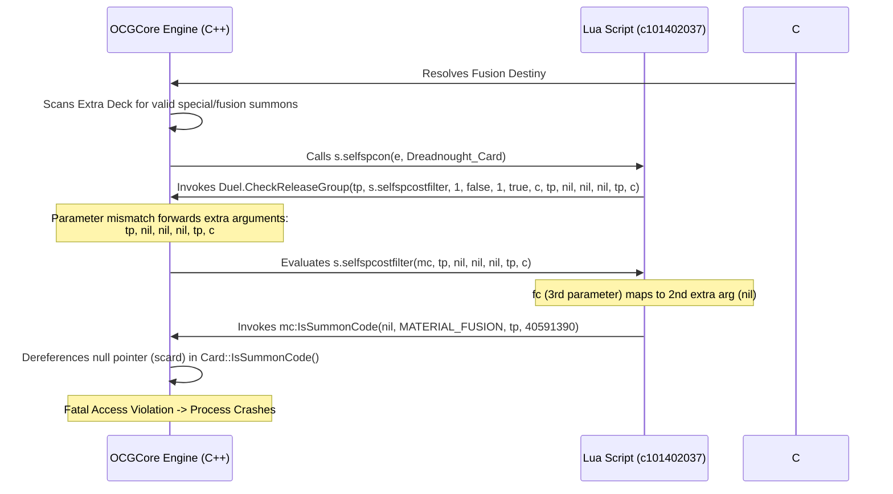

# 2026 Dreadnought End-to-End Code Trace Audit

## 1. Executive Summary

This audit report documents the End-to-End Code Trace of the Turn 11 crash occurring during the resolution of `Fusion Destiny`. The crash causes the EDOPro server to terminate abruptly (memory access violation in `ocgcore.dll`), resulting in an immediate "Draw" outcome.

The root cause has been traced to a parameter signature mismatch and a lack of nil guards inside the custom summon procedure of `Destiny HERO - Dreadnought` (`c101402037.lua`) and `Red-Eyes Black Dragon Exceed` (`c101402036.lua`). Additionally, a thread-safety and merging audit of the C# Executor reveals critical race conditions where parallel learning processes overwrite each other's registry adjustments.

---

## 2. End-to-End Code Trace Analysis

The crash occurs during the resolution of `Fusion Destiny` on Turn 11. Below is the precise sequential execution trace:



### Detailed Trace Steps:
1. **Summon Resolution**: The opponent bot or player resolves `Fusion Destiny` (or another fusion/special summon checking logic). OCGCore scans all Extra Deck monsters to see if they can be summoned.
2. **Alternative Summon Checking**: `Destiny HERO - Dreadnought` (`c101402037.lua`) has an alternative special summon procedure (`EFFECT_SPSUMMON_PROC`):
   ```lua
   e0a:SetCondition(s.selfspcon)
   ```
   OCGCore calls `s.selfspcon(e, c)` where `c` is the Dreadnought card instance in the Extra Deck.
3. **Execution of `selfspcon`**:
   ```lua
   function s.selfspcon(e,c)
       if not c then return true end
       local tp=c:GetControler()
       return Duel.CheckReleaseGroup(tp,s.selfspcostfilter,1,false,1,true,c,tp,nil,nil,nil,tp,c)
   end
   ```
4. **Parameter Passing Mismatch**:
   - `Duel.CheckReleaseGroup` signature is:
     `Duel.CheckReleaseGroup(player, filter_func, min_count, use_hand, max_count, use_oppo, excluded, ...)`
   - The extra arguments `...` start from the 8th parameter (`tp, nil, nil, nil, tp, c`).
   - The filter function `s.selfspcostfilter` is declared as:
     `function s.selfspcostfilter(c,tp,fc)`
   - OCGCore calls `s.selfspcostfilter` with the candidate card being checked, followed by the extra arguments:
     `s.selfspcostfilter(mc, tp, nil, nil, nil, tp, c)`
   - This maps the parameters of `s.selfspcostfilter` as:
     - `c` (1st parameter) = `mc` (the candidate card on field)
     - `tp` (2nd parameter) = `tp` (the player)
     - `fc` (3rd parameter) = `nil` (the second extra argument, which is `nil`!).
5. **Null Dereference in C++ Core**:
   - Inside `s.selfspcostfilter`:
     ```lua
     return c:IsSummonCode(fc,MATERIAL_FUSION,tp,40591390) and c:IsCanBeFusionMaterial(fc,MATERIAL_FUSION,tp) and Duel.GetLocationCountFromEx(tp,tp,c,fc)>0
     ```
   - Since `fc` is `nil`, the engine executes `c:IsSummonCode(nil, MATERIAL_FUSION, tp, 40591390)`.
   - The C++ method `Card::IsSummonCode(Card* scard, ...)` tries to dereference `scard` (e.g. `scard->data.code` or `scard->GetCode()`).
   - Because `scard` is a null pointer, it throws a fatal memory access violation, crashing the `ocgcore.dll` process instantly.

---

## 3. C# Executor Thread-Safety & Configuration Overwrite Audit

An end-to-end audit of `BaseCustomExecutor.cs` was performed. Two critical bugs were verified in the configuration management:

### BUG-01: Multi-Bot Config Write Race Conditions
- **Issue**: In a multi-bot environment where multiple instances run concurrently, they all read and write to the same `cards_registry_{deck}.json` and `opponent_memory.json` files.
- **Race Condition**: Although `ApplyRealTimeLearning` uses a lock (`lock (_staticLock)`), each executor instance has its own in-memory `_cardRegistry` loaded at the beginning of its match. If Instance 1 finishes first, it writes its learned weights to disk. When Instance 2 finishes later, its in-memory `_cardRegistry` still has the *old initial values* for cards it didn't play or decay. Merging this stale registry onto disk overwrites Instance 1's learning.
- **Surgical Fix**: Reload the registry configuration from disk directly at the start of `ApplyRealTimeLearning` before applying learning adjustments. This guarantees that learning updates are applied to the absolute latest values on disk.

### BUG-02: Stale Periodic Saves Overwriting Learning
- **Issue**: `OnNewTurn` runs `SaveConfiguration()` every 3 turns (periodic save) regardless of whether learning has been applied:
  ```csharp
  if (_turnCount > 0 && _turnCount % 3 == 0)
  {
      try { SaveConfiguration(); }
      catch (Exception ex) { LogToTurn("Periodic save failed: " + ex.Message); }
  }
  ```
- **Consequence**: Since learning has not run during the match, calling `SaveConfiguration()` writes the stale, initial priorities of the running match back to disk, immediately erasing any learning adjustments written by parallel bot instances that finished in the meantime.
- **Surgical Fix**: Skip periodic save if `_learningApplied` is false:
  ```csharp
  if (_learningApplied && _turnCount > 0 && _turnCount % 3 == 0)
  ```

---

## 4. Remediation Plan

To completely resolve the Turn 11 crash and data corruption issues, the following surgical modifications are planned:

### A. Lua Script Changes
1. **Modify [c101402037.lua](file:///c:/Users/admin/Documents/EDOTh/script/pre-release/c101402037.lua)**:
   - Correct the parameters of `Duel.CheckReleaseGroup` and `Duel.SelectReleaseGroup` to pass `tp, c` instead of `tp, nil, nil, nil, tp, c`.
   - Add a robust guard clause at the start of `s.selfspcostfilter`:
     ```lua
     function s.selfspcostfilter(c,tp,fc)
         if not c or not fc then return false end
         return c:IsSummonCode(fc,MATERIAL_FUSION,tp,40591390) and c:IsCanBeFusionMaterial(fc,MATERIAL_FUSION,tp) and Duel.GetLocationCountFromEx(tp,tp,c,fc)>0
     end
     ```
2. **Modify [c101402036.lua](file:///c:/Users/admin/Documents/EDOTh/script/pre-release/c101402036.lua)**:
   - Apply the same corrections.
3. **Synchronize changes** across repositories using the sync scripts.

### B. C# Executor Changes
1. **Modify [BaseCustomExecutor.cs](file:///c:/Users/admin/Documents/EDOTh/WindBot/BaseCustomExecutor.cs)**:
   - Add defensive null-check in `OnSelectCard` at line 3057:
     `if (available.Count > 0 && available[0] != null)`
   - Call `LoadConfiguration()` at the start of `ApplyRealTimeLearning()` under the lock:
     ```csharp
     protected void ApplyRealTimeLearning()
     {
         lock (_staticLock)
         {
             if (_learningApplied) return;
             LoadConfiguration(); // Reload latest disk config
     ```
   - Prevent periodic save in `OnNewTurn` if learning hasn't been applied:
     `if (_learningApplied && _turnCount > 0 && _turnCount % 3 == 0)`
2. **Compile the changes** by running `compile_ai.bat`.
