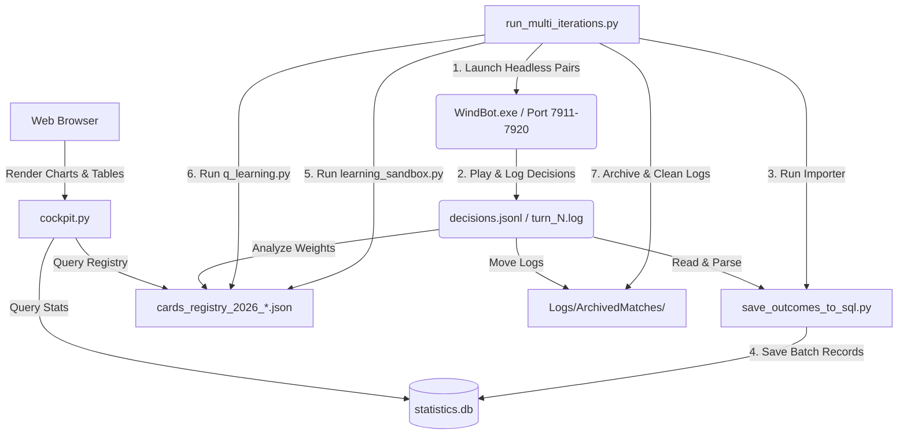

# สถาปัตยกรรมระบบจำลองดวลแบบขนานและการวิเคราะห์ผลการเรียนรู้ (Multi-Instance Headless Simulation & Evaluation Architecture)

เอกสารฉบับนี้อธิบายรายละเอียดโครงสร้างระบบโครงสร้างพื้นฐานใหม่ (Infrastructure) สำหรับการรันบอทจำลองดวลกันแบบขนานจำนวนมาก (10-20 จอ) การบันทึกและรวบรวมพฤทีกรรมการตัดสินใจและบอร์ดคู่ต่อสู้ลงฐานข้อมูล SQLite แบบเรียลไทม์ และระบบ Dashboard วิเคราะห์วัดผลการดวลอย่างเป็นรูปธรรม

---

## 1. แผนผังภาพรวมการทำงาน (System Flow Diagram)

ลูปการเรียนรู้ด้วยการแข่งขนานของบอทประกอบไปด้วยส่วนประกอบประสานงานกันดังนี้:



---

## 2. ส่วนประกอบในระบบ (Component Deep Dive)

### 2.1 C# AI Engine (`BaseCustomExecutor.cs` และลูกหลาน `2026_`)
สมองหลักของบอทได้รับการอัปเดตเพื่อรองรับการดวลซ้ำๆ ในห้องเดิมโดยไม่ค้างและรวบรวมสถานะบอร์ดฝ่ายตรงข้าม:
*   **แก้ไขระบบ Reset ห้อง (Persistent Session Logging Bug):**
    *   บอท WindBot จะทำงานค้างอยู่ในเซิร์ฟเวอร์ LAN Host เดิมเพื่อเริ่มแมตช์ถัดไปเรื่อยๆ เมื่อบอทอินสแตนซ์ใหม่ถูกสร้างขึ้นเพื่อดวลต่อ ตัวแปร `_currentInstance` ของบอทตัวเดิมจะทำการสั่ง `ApplyRealTimeLearning()` เพื่อเซฟผลลัพธ์ของตาก่อนหน้าลงไฟล์ประวัติตระกูล `match_summary.log` และ `decisions.jsonl` ก่อนจะถูกทำลายทิ้ง ป้องกันล็อกบวมและข้อมูลสูญหาย
*   **การสแกนข้อมูลฝั่งตรงข้าม (Opponent Board Reading):**
    *   บอท C# จะทำการแปลงบอร์ดฝ่ายตรงข้าม ณ ทุกจังหวะที่มีการถามตัดสินใจ (Normal Summon, Special Summon, Activate) ให้กลายเป็นข้อมูล JSON เช่น มอนสเตอร์ฝั่งตรงข้ามที่มองเห็นทั้งหมด, ระดับความอันตราย (Danger Score) ของมอนสเตอร์แต่ละตัว, การ์ดเวทมนตร์และกับดักที่เปิดเผยอยู่, และการ์ดบนมือของเรา
    *   ข้อมูลเหล่านี้จะถูกแนบไปในแต่ละสเตปการตัดสินใจลงในไฟล์ `decisions.jsonl` เพื่อนำเข้าฐานข้อมูลใช้ในลูปการฝึกฝน

### 2.2 ฐานข้อมูลเก็บผลการเรียนรู้ (`statistics.db`)
ฐานข้อมูล SQLite ทำหน้าที่เก็บสถิติรวมของทุกตาแข่งและทุกการตัดสินใจ เพื่อหลีกเลี่ยงปัญหา Write Lock (ฐานข้อมูลล็อกเนื่องจากเขียนชนกันตอนจำลอง 20 จอ) เราจะไม่เขียน SQLite ตรงๆ จาก C# แต่จะให้ C# เขียนลงไฟล์ JSON ในห้องตัวเองแยกกัน และให้ Python อ่านมารวมส่งเข้า SQLite ในเธรดเดียว:
*   **ตาราง `matches`:**
    *   `id`: คีย์หลัก
    *   `session_name`: ชื่อโฟลเดอร์แมตช์
    *   `deck_self`: ชื่อเด็คฝั่งเรา
    *   `opponent_deck`: ชื่อเด็คฝ่ายตรงข้าม (เพิ่มเข้ามาใหม่เพื่อใช้ในการวัดอัตราชนะแยกเด็ค)
    *   `outcome`: ผลแพ้ชนะ (Win, Loss, Draw, WeakWin, WeakLoss)
    *   `bot_lp`: ค่า LP ฝั่งเราเมื่อจบเกม
    *   `opp_lp`: ค่า LP ฝั่งตรงข้ามเมื่อจบเกม
    *   `turns`: จำนวนเทิร์นที่เล่นในแมตช์นั้น
*   **ตาราง `decisions`:**
    *   เก็บประวัติการกระทำทุกสเตปของการ์ด (Card ID, ชื่อ, การตัดสินใจเลือก/ไม่เลือก, แผนคอมโบ, คะแนนความพึงพอใจ, และสถานะบอร์ดการ์ดของฝั่งตรงข้ามในขณะนั้น) เพื่อเอามาวิเคราะห์ย้อนหลัง

### 2.3 ตัวรันระบบขนานหลัก (`run_multi_iterations.py`)
ทำหน้าที่ประสานงานและรันลูปการดวลและการเรียนรู้:
*   จำลองการแข่ง 10-20 จอผ่านคำสั่ง `--instances` ในโหมด Headless (เบื้องหลัง)
*   ระบบอัปเดตสถิติมอนิเตอร์หน้าจอสดทีละพอร์ต (Live Status Tracker) ป้องกันโค้ดจอดำหรือแครชบน Windows Codepage Thai (CP874)
*   **ระบบเทรนสองฝ่ายพร้อมกัน (Self-Play Learning Loop):**
    *   หากผู้ใช้ระบุเด็คฝ่ายตรงข้ามเป็นตระกูล `2026_` ระบบจะสแกนโฟลเดอร์แมตช์ของคู่แข่งด้วย และรันคำสั่งอัปเดตน้ำหนักค่าน้ำหนักตัดสินใจและ Q-learning ของทั้ง 2 เด็คคู่กัน ทำให้การดวล 1 แมตช์ ทั้งสองฝ่ายได้ปรับปรุงสมองและลับคมให้ฉลาดขึ้นร่วมกันทันที
*   **การล้างโฟลเดอร์เพื่อลดภาระดิสก์ (Log Archiving):**
    *   ย้ายล็อกห้องย่อยที่ประมวลผลเสร็จเรียบร้อยแล้วเข้าโฟลเดอร์ `ArchivedMatches` และเคลียร์ไฟล์ขยะชั่วคราวในโฟลเดอร์ `ParallelMatches` ทุกรอบการเทรน ป้องกันการประมวลผลประวัติซ้ำซ้อนและลดความบวมของโฟลเดอร์ WindBot

### 2.4 แดชบอร์ดและหน้าวัดผลการพัฒนา (`cockpit.py` & `progress.html`)
ระบบวิเคราะห์ผลได้รับการออกแบบใหม่หมดจดเพื่อลดการดึงข้อมูลจาก Log เปล่าๆ แล้วหันมาคิวรี SQLite แทน พร้อมแผงควบคุมระบบฝึกฝน (Dashboard) ที่ขยายความสามารถให้ยืดหยุ่น:
*   **การเลือกเด็คที่ไม่จำกัด:** หน้า Dashboard ดึงรายชื่อเด็คทั้งหมดในระบบออกมาแสดง (`ai_only=False`) เพื่อให้สู้หรือทดสอบกับเด็คภายนอก/เด็คเก่าได้ทันที
*   **พอร์ตเชื่อมต่ออิสระ (7911-7999):** ผู้ใช้สามารถระบุพอร์ตที่ต้องการใช้งานจริงเพื่อสร้างห้องจำลองในลูป ทำให้ไม่จำกัดพอร์ตและป้องกันพอร์ตชนกันในระบบ
*   **ทางเลือกจำนวนบอทต่อห้อง (1 หรือ 2 ตัว):**
    *   **บอท 1 ตัว (Bot Count = 1):** ใช้สำหรับผู้ใช้สร้างห้องขึ้นมาเองใน EDOPro แล้วสั่งให้บอทหลักเชื่อมเข้ามาดวลกับผู้ใช้โดยตรง (User vs Bot Loop)
    *   **บอท 2 ตัว (Bot Count = 2):** ระบบจำลองคู่ต่อสู้ให้พร้อมกันทั้ง 2 ตัว ผู้ใช้สามารถเชื่อมต่อเข้าห้องบนพอร์ตนั้นในสถานะผู้สังเกตการณ์ (Spectator) เพื่อดูการพัฒนาได้
*   **API `/api/progress_report`:**
    *   คิวรีข้อมูลแมตช์ของเด็คที่เลือก เรียงลำดับเวลาเก่าไปใหม่
    *   จัดกลุ่มเกมการแข่งออกเป็นบล็อกตามรอบการดวล (เช่น บล็อกละ 10 เกม)
    *   หาความก้าวหน้าในแต่ละบล็อก: อัตราชนะ %, คะแนนตัดสินใจเฉลี่ย, และรอบเทิร์นเฉลี่ย
    *   เปรียบเทียบบล็อกแรก (ก่อนเทรน) กับบล็อกสุดท้าย (หลังเทรน) เพื่อหาผลลัพธ์การพัฒนา (Performance Deltas)
*   **แดชบอร์ดวัดผลการเรียนรู้:**
    *   แสดงการ์ดเปรียบเทียบ Before & After ของอัตราชนะ คะแนนตัดสินใจ และรอบเทิร์นเฉลี่ย พร้อม Badge สรุปทิศทางการเปลี่ยนแปลง
    *   พล็อตกราฟเส้น Chart.js อัตราชนะที่ไต่ระดับสูงขึ้น (Learning Curve)
    *   พล็อตกราฟเปรียบเทียบคะแนนตัดสินใจเฉลี่ยของบอทที่ค่อยๆ ฉลาดขึ้น (Score Curve) พร้อมแนวโน้มเทิร์นที่ลดลงเนื่องจากบอทเข้าใจเด็คตัวเองมากขึ้น

---

## 3. วิธีการนำระบบไปใช้งานสำหรับการเรียนรู้ขนาน (How to Train)

### 3.1 ขั้นตอนการรันฝึกฝนดวลกันเอง (Self-Play Training)
รันคำสั่งฝึกฝนเด็ค `2026_EvilTwin` ปะทะกับเด็ค `2026_Invoke` จำนวน 10 จอพร้อมกันจำนวน 5 รอบ (รวม 50 แมตช์) ด้วยคำสั่ง:

```bash
python scratch/run_multi_iterations.py --deck 2026_EvilTwin --opponent 2026_Invoke --opp-deck 2026_Invoke --instances 10 --rounds 5
```

ระบบจะค่อยๆ รันทีละรอบ พล็อตสถิติลงตารางสดบนคอนโซล นำเข้าประวัติเข้า SQLite และอัปเดตน้ำหนัก Registry ใน Sandbox และ LIVE ทันทีระหว่างแต่ละรอบเพื่อให้บอทนำน้ำหนักใหม่ไปสู้กันในรอบถัดไป

### 3.2 การดูรายงานและกราฟบนหน้าเว็บ Cockpit
1.  เปิดระบบควบคุม Cockpit:
    ```bash
    python WindBot_Sandbox/cockpit.py
    ```
2.  เปิดหน้าเว็บเบราว์เซอร์และเข้าไปที่เมนู **"📈 วัดผล (Progress)"** ด้านบน
3.  เลือกเด็คที่พึ่งรันเทรน เช่น `2026_EvilTwin`
4.  เลือกขนาดบล็อกของการจัดกลุ่ม เช่น `10 แมตช์ต่อรอบ`
5.  กดปุ่ม **"📊 โหลดความก้าวหน้า"**
    *   ระบบจะวาดกราฟ Chart.js ทันที พร้อมแสดงอัตราชนะที่เปลี่ยนแปลงไปและตารางสรุป
