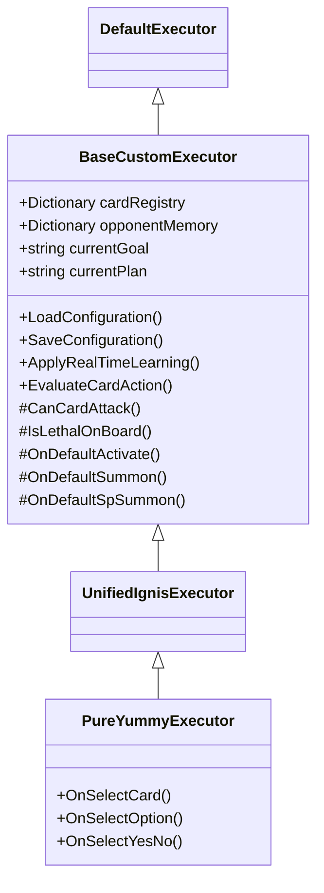
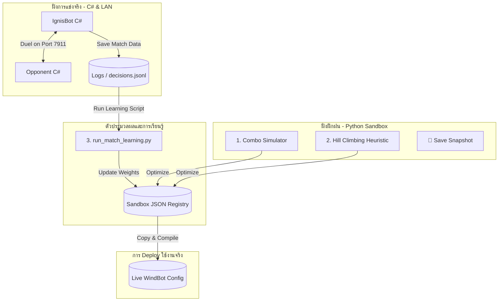

# เอกสารโครงสร้างระบบและคู่มือควบคุม Cockpit (System Architecture & Cockpit Guide)
> **โครงการ:** WindBot IGNIS Engine  
> **อัปเดตล่าสุด:** 2026-05-24 | **สถานะ:** เสร็จสมบูรณ์ (โครงสร้างแบบ Modular)

เอกสารนี้แสดงภาพรวมโครงสร้างสถาปัตยกรรมระบบทั้งหมดของ **WindBot IGNIS** หลังจากการปรับปรุงโครงสร้าง (Refactor) เป็นแบบแยกชั้นคลาสฐาน (Base Class Separation) รวมถึงรายละเอียดคลาส, ทุก API ของระบบ C# และ Python Cockpit, ตลอดจนขั้นตอนการพัฒนาลอจิกสำหรับเด็คใหม่ในอนาคต

---

## 📂 1. ภาพรวมโครงสร้างไดเรกทอรี (Directory & File Structure)

ระบบทำงานร่วมกันระหว่างส่วนประกอบหลัก 3 ส่วน ได้แก่ **WindBot Core (C#)**, **WindBot Sandbox (Python)** และ **EDOPro (Game Engine)** โดยจัดเก็บข้อมูลดังนี้:

```text
EDOTh/
├── Docs/                               # เอกสารคู่มือและการวิเคราะห์ระบบ
│   ├── Rules.md                        # กฎเหล็ก (Iron Rules) และแผนผัง Scope
│   ├── New_Deck_Creation...Guide.md    # ขั้นตอนการสร้างเด็คและฝึกฝน
│   └── System_Architecture...Guide.md  # [เอกสารฉบับนี้] โครงสร้างสถาปัตยกรรม
│
├── WindBot/                            # ตัวรันบอทหลัก (C# Source & Assembly)
│   ├── BaseCustomExecutor.cs           # [NEW] คลาสฐานกลางสำหรับเก็บลอจิกแกนหลัก
│   ├── UnifiedIgnisExecutor.cs         # คลาสสืบทอดที่เก็บการจดทะเบียนเด็คหลัก
│   ├── PureYummyExecutor.cs            # [NEW] คลาสรันลอจิกเด็คเฉพาะตัวของเด็ค Pure Yummy
│   ├── Executors/
│   │   └── UnifiedIgnisExecutor.dll    # ไฟล์ไดนามิกลิงก์ไลบรารีที่ถูกคอมไพล์แล้ว
│   ├── config/
│   │   ├── decks/                      # สไตล์การเล่นเด็ค (control/combo) ของแต่ละเด็ค
│   │   ├── card_names.json             # ฐานข้อมูลชื่อการ์ด (จับคู่ ID -> Name)
│   │   └── opponent_memory.json        # ความจำความอันตรายของการ์ดฝ่ายตรงข้าม (learned_danger)
│   ├── Decks/                          # ไฟล์การ์ดลิสต์ย่อย (.ydk)
│   ├── Logs/                           # ล็อกไฟล์แยกตามเซสชันการดวลจริง (match_summary.log, decisions.jsonl)
│   ├── bots.json                       # ทะเบียนตัวตนและสไตล์ของบอทในระบบ LAN
│   ├── compile_ai.bat                  # สคริปต์คอมไพล์ C# (บิลด์ Base + Unified + PureYummy)
│   └── WindBot.exe                     # ตัวประมวลผลบอท
│
└── WindBot_Sandbox/                    # ระบบการเรียนรู้และหน้าจอควบคุม (Python)
    ├── cockpit.py                      # สคริปต์เซิร์ฟเวอร์ Cockpit Web Dashboard
    ├── optimize_registry.py            # Hill Climbing จูนน้ำหนักแบบออฟไลน์
    ├── combo_simulator.py              # ตัวจำลองการจั่วการ์ดมือแรกเพื่อหาความเสถียร
    ├── run_match_learning.py           # สคริปต์สกัดประวัติ Logs เพื่อรัน Reinforcement Learning
    ├── parallel_launcher.py            # ตัวเปิดการแข่งขันจำลองคู่ขนาน (Headless Parallel Matches)
    ├── templates/                      # โครงสร้างหน้าเว็บ Dashboard (HTML/JS)
    └── snapshots/                      # โฟลเดอร์เก็บสถานะน้ำหนักการ์ดก่อนการฝึกฝน (📸 Snapshot)
```

---

## 🏛️ 2. สถาปัตยกรรมระดับคลาส & ข้อมูลทางเทคนิค (Class-Level Architecture)

เราได้แยกโครงสร้างส่วนรันคำสั่งบอทออกเป็นสองชั้นชัดเจน เพื่อให้ง่ายต่อการย้าย รื้อถอน แก้ไข และดีบั๊กในอนาคต:



### 2.1 โครงสร้างระดับคลาสของ C# (WindBot Core Class API)

#### คลาสฐานกลาง: [BaseCustomExecutor](file:///c:/Users/admin/Documents/EDOTh/WindBot/BaseCustomExecutor.cs)
ทำหน้าที่เปรียบเสมือน **"ระบบปฏิบัติการและเกราะความปลอดภัย"** ของบอท:
* **คุณสมบัติและฟิลด์ที่สำคัญ (Properties & Fields):**
  * `_cardRegistry` (`Dictionary<int, CardMetadata>`): เก็บค่าน้ำหนักของการ์ดแต่ละใบ ได้แก่ Priority, Risk, Bait, Follow-up, Recovery และค่า Q-Values ที่จูนขึ้นมา
  * `_opponentMemory` (`Dictionary<int, OpponentCardMeta>`): บันทึกข้อมูลประวัติความอันตรายของการ์ดแต่ละใบของฝ่ายตรงข้าม (`learned_danger`)
  * `_cardNames` (`Dictionary<int, string>`): จับคู่รหัสการ์ด (ID) กับชื่อภาษาไทย/อังกฤษของตัวการ์ด
  * `_currentGoal` (`string`): เป้าหมายกลยุทธ์การเล่นขณะนั้น เช่น `establish_interruptions` (คุมบอร์ดเทิร์นแรก), `survive` (เอาตัวรอด), `push_lethal` (ปิดเกม)
  * `_currentPlan` (`string`): แผนคอมโบปัจจุบัน (ปกติเริ่มต้นด้วย `PlanA`)
  * `_ourCardsPlayed` (`List<int>`): รายชื่อ ID การ์ดที่เราเปิดใช้งานในการดวลรอบปัจจุบัน เพื่อใช้ทำ Reinforcement Learning
  * `_disruptionsInMatch` (`Dictionary<int, List<int>>`): รายการการ์ดของคู่ต่อสู้ที่เข้ามาขัดขวาง (Disrupt) การ์ดเรา
* **ฟังก์ชันและ API ปฏิบัติการหลัก (Core Methods & APIs):**
  * `LoadConfiguration()`: โหลดไฟล์ registry จาก `cards_registry_[เด็ค].json` และ `opponent_memory.json` โดยรองรับระบบกู้คืนไฟล์สำรอง (Backup `.bak`)
  * `SaveConfiguration()`: เขียนการตั้งค่าที่ถูกอัปเดตลงไฟล์ด้วยระบบป้องกันการชนทับข้อมูล (Retry Loop)
  * `ApplyRealTimeLearning()`: อัปเดตข้อมูล Priority/Risk และความจำความอันตรายของการ์ดฝ่ายตรงข้ามย้อนหลังหลังจบการแข่งขัน
  * `EvaluateCardAction(ClientCard card, CardMetadata meta, ExecutorType type)`: เมธอดในการประเมินการเปิดใช้เอฟเฟกต์การ์ด การซัมมอน หรือการทริกเกอร์
  * `CanCardAttack(ClientCard card)`: ตรวจสอบความปลอดภัยก่อนสั่งโจมตี (เช่น เช็กการล็อกของ Mystic Mine, Messenger of Peace, Gravity Bind, Swords of Revealing Light)
  * `IsLethalOnBoard()`: จำลองพลังโจมตีของมอนสเตอร์ฝั่งเราทั้งหมด เปรียบเทียบกับบอร์ดและค่า Life Points ของคู่ต่อสู้ เพื่อตรวจสอบว่าสามารถปิดเกมในรอบนี้ได้ทันทีหรือไม่
  * `LogDecision(int cardId, string action, string goal, double score, bool decision, string plan)`: บันทึกข้อมูลการตัดสินใจและค่าน้ำหนักลงไฟล์ [decisions.jsonl](file:///c:/Users/admin/Documents/EDOTh/WindBot/Logs/)
  * `LogToMatch(string message)` / `LogToTurn(string message)`: เก็บความคืบหน้าของแมตช์และเทิร์นลงในไดเรกทอรีประวัติเซสชัน

#### คลาสจดทะเบียนเด็ค: [UnifiedIgnisExecutor](file:///c:/Users/admin/Documents/EDOTh/WindBot/UnifiedIgnisExecutor.cs)
ทำหน้าที่เป็น **"ผู้จดทะเบียนเด็คหลัก"**:
* สืบทอดความสามารถและตัวแปรทั้งหมดมาจาก `BaseCustomExecutor`
* ประกอบด้วยผู้สืบทอดแยกตามเด็คของบอทเพื่อรับค่าแอตทริบิวต์ `[Deck("ชื่อเด็ค", "ไฟล์เด็ค")]` เพื่อผูกบอทเข้ากับรายชื่อเด็คใน LAN
* ตัวคลาสหลักจะทำหน้าที่เป็นสะพานเชื่อมให้ WindBot เรียกใช้งาน Executor subclass ที่เฉพาะเจาะจงได้ถูกต้องตามเด็คที่ใช้

#### คลาสประมวลผลเด็คเฉพาะทาง: [PureYummyExecutor](file:///c:/Users/admin/Documents/EDOTh/WindBot/PureYummyExecutor.cs)
ทำหน้าที่เป็น **"โมดูลประมวลผลลอจิกเฉพาะทางแยกเด็ค"**:
* สืบทอดความสามารถมาจาก `UnifiedIgnisExecutor` และเขียนทับ (Override) ลอจิกเฉพาะสำหรับเด็ค Pure Yummy
* **การเขียนทับเมธอดที่สำคัญ (Overridden Methods):**
  * `EvaluateCardAction`: ลอจิกการอัญเชิญ Marshmao, Cupsy, Lollipo, Cooky และคอมโบการเรียกซิงโครแบบเร่งด่วนของ Snatchy ในเทิร์นตรงข้าม รวมถึงการถอนตัวสลับการ์ด (Tag-Out) ในสุสาน
  * `OnSelectCard`: คำนวณลำดับการหยิบการ์ดขึ้นมือ (เช่น เสิร์ช Cupsy ก่อน), ลำดับการทิ้งการ์ดเพื่อนำไปเป็นวัตถุดิบ (เช่น ทิ้ง Marshmao), การระบุวัตถุดิบในการซัมมอน ลิงก์/ซิงโคร และเป้าหมายที่ต้องการนำกลับขึ้นมือ
  * `OnSelectOption`: เลือกออปชันเอฟเฟกต์ของการ์ด (เช่น Yummy☆Surprise) โดยแยกเงื่อนไขตามบอร์ดและรอบเทิร์นของบอท
  * `OnSelectYesNo`: ตอบรับทริกเกอร์เลือกเปิดใช้งานการ์ด (ตอบรับ True เสมอเพื่อรักษาคอมโบต่อเนื่อง)

---

## 🖥️ 3. ระบบควบคุม Cockpit Dashboard & Python APIs

**Cockpit** คือหน้าแดชบอร์ดควบคุมที่รันอยู่บนพอร์ต **8000** ทำหน้าที่มอนิเตอร์และสั่งการระบบ ผ่าน Python backend ([cockpit.py](file:///c:/Users/admin/Documents/EDOTh/WindBot_Sandbox/cockpit.py))

### 3.1 ฟังก์ชันและหน้าหลักบนแดชบอร์ด (Dashboard Features)
1. **หน้าจอหลัก (Dashboard):** แสดงสถานะความพร้อมของสารบบการ์ด, บันทึกการแข่งขันย้อนหลัง, ความจำฝั่งศัตรู และสวิตช์สำหรับเลือกเด็คที่ต้องการทำงานหรือเทรน
2. **ระบบการวิเคราะห์และประเมินผล (Analytics):**
   - `/analytics`: แสดงตารางผลการรัน ประวัติอัตราชนะ และค่าคะแนนความอันตรายของการ์ดฝ่ายตรงข้าม
   - ดักดึงประวัติการตัดสินใจจากการสลายล็อก `decisions.jsonl` เพื่อแสดงคะแนนความสำคัญและทิศทางการเปลี่ยนเป้าหมายบอท (Goal Shifting)
3. **ระบบตรวจสอบความก้าวหน้า (Progress):**
   - `/progress`: แสดงแผนภาพเปรียบเทียบค่าน้ำหนักก่อน/หลังฝึกฝน และความจำฝั่งตรงข้ามที่เพิ่มขึ้น

### 3.2 รายการ API ทั้งหมด (Python Endpoint Registry)

#### API สำหรับดึงข้อมูล (GET Requests)
* **`GET /api/decks`**: ดึงรายชื่อเด็คทั้งหมดที่อยู่ในคลัง (.ydk) และที่มี registry ตั้งค่าไว้
* **`GET /api/opponents`**: ดึงรายชื่อบอทจำลองฝ่ายตรงข้ามทั้งหมดจากไฟล์ `bots.json`
* **`GET /api/status?deck=[ชื่อเด็ค]`**: ดึงสถิติจำนวนการ์ดในสารบบจำลองเทียบกับระบบจริง, จำนวน match logs และ opponent memory ของเด็คนั้น
* **`GET /api/progress`**: ดึงเนื้อหา log การจำลองสดล่าสุดจากไฟล์ `training_progress.log` เพื่อนำไปพ่นลงสตรีมบนแดชบอร์ด
* **`GET /api/match_history`**: ประมวลผลและส่งประวัติย้อนหลังของแมตช์ทั้งหมด (อัตราแพ้ชนะ, เลือดบอท, เลือดศัตรู, เป้าหมายหลักที่เปิดใช้)
* **`GET /api/registry_snapshot?deck=[ชื่อเด็ค]`**: ดึงประวัติค่าน้ำหนักและการประเมินสัดส่วนของ Registry ปัจจุบันของเด็คที่กำหนด
* **`GET /api/progress_report?deck=[ชื่อเด็ค]`**: รายงานการปรับเปลี่ยนการ์ดเปรียบเทียบระหว่างบอดปัจจุบันกับ Snapshot ล่าสุด

#### API สำหรับการดำเนินการ (POST Requests)
* **`POST /api/train`**: ส่งข้อมูลเพื่อเริ่มการฝึกฝนบอท (รับ Payload: `{"deck": "...", "opponent": "...", "mode": "...", "iterations": ...}`)
  * โหมดการเทรน (`mode`) รองรับ 4 รูปแบบ:
    1. `heuristic`: รันการหาค่าน้ำหนักมือแรกผ่าน Hill Climbing (`optimize_registry.py`)
    2. `simulator`: วัดผลอัตราความสำเร็จของคอมโบเริ่มต้น (`combo_simulator.py`)
    3. `real_match`: การประมวลผลปรับแต่ง Priority จากประวัติล็อกแข่งย้อนหลัง (`run_match_learning.py`)
    4. `live_duel`: การเปิดบอท IgnisBot ปะทะบอทฝึกซ้อม รันแข่งกันคู่ขนานบนพอร์ต 7911 (`run_live_duel_loop`)
* **`POST /api/kill`**: สั่งหยุดและทำลาย (Kill Process) โปรเซสการรันและการแข่งจำลองทั้งหมดทันที
* **`POST /api/deploy`**: สำเนาไฟล์การตั้งค่า `cards_registry_[เด็ค].json` จากฝั่ง Sandbox ไปทับไฟล์จริงของบอท และรันสคริปต์ [compile_ai.bat](file:///c:/Users/admin/Documents/EDOTh/WindBot/compile_ai.bat) เพื่ออัปเดตไฟล์ DLL ทันที
* **`POST /api/snapshot`**: สั่งบันทึก Baseline ล่าสุดของการตั้งค่าบอทเพื่อเก็บสถานะประเมินผลเชิงเปรียบเทียบ

---

## 🔄 4. ท่อส่งการทำงานและกระบวนการเรียนรู้ (Training & Deployment Pipeline)

ระบบสามารถทำการเรียนรู้ย้อนหลังได้หลายรูปแบบดังรูปด้านล่าง:



### 4.1 โหมดการฝึกฝน 4 รูปแบบ (Training Modes)
1. **Heuristic Optimization ([optimize_registry.py](file:///c:/Users/admin/Documents/EDOTh/WindBot_Sandbox/optimize_registry.py)):**
   - รัน Hill Climbing จำลองจั่วการ์ดมือแรก (ปกติ 300 รอบ)
   - ดัน Priority ของการ์ดเริ่มเล่น (Starter) ให้สูงขึ้น และดึง Priority ของการ์ดเน่ามือ (Brick) ลงต่ำ
2. **Combo Simulator ([combo_simulator.py](file:///c:/Users/admin/Documents/EDOTh/WindBot_Sandbox/combo_simulator.py)):**
   - รันจำลองมือเริ่มต้นเพื่อวัดอัตราความสำเร็จของคอมโบ (เปรียบเทียบอัตราสำเร็จของเด็คต่างๆ เช่น Plan A, Plan B หรือโอกาสจั่วเน่า)
   - ปรับแต่งค่าน้ำหนัก priority และ bait_value ของการ์ดกู้สถานการณ์ย้อนกลับไปเก็บที่ไฟล์ Registry
3. **Real Match Learning ([run_match_learning.py](file:///c:/Users/admin/Documents/EDOTh/WindBot_Sandbox/run_match_learning.py)):**
   - อ่านล็อกการดวลจริงล่าสุด นำการ์ดที่มีส่วนทำให้ชนะมาเพิ่ม priority และการ์ดที่โดนคู่แข่งขัดขวางมาเพิ่มค่าความเสี่ยง (`risk_if_negated`)
4. **Live Duel Simulation (`run_live_duel_loop`):**
   - เปิดระบบรัน `WindBot.exe` สองตัวเข้ามาหวดกันเองแบบไร้หน้าจอ (Headless Mode) บนพอร์ต 7911 ต่อเนื่องกันตามจำนวนรอบที่ระบุเพื่อปั๊มข้อมูล Logs

### 4.2 ระบบความปลอดภัยและการตรวจทานความคืบหน้า (Snapshot & Progress Report)
* **การบันทึกสถานะ (📸 Save Snapshot):** คัดลอกสารบบการ์ดและความจำฝ่ายตรงข้าม ณ ปัจจุบัน เก็บลงไดเรกทอรี `snapshots/[deck]_[timestamp]` เพื่อล็อกเป็นจุดเริ่มต้น (Baseline)
* **การเปรียบเทียบความคืบหน้า (Progress Report):** หน้าเว็บจะเปรียบเทียบค่า Registry ปัจจุบันกับ Snapshot ล่าสุดเพื่อระบุ:
  - การ์ดที่ได้รับการปรับขึ้น/ลงของ Priority (บัฟการ์ดที่ทำคอมโบสำเร็จ / ลดความสำคัญการ์ดที่เน่า)
  - ความอันตรายของการ์ดฝ่ายตรงข้ามที่บันทึกเพิ่มขึ้น (opponent learned_danger)
  - อัตราชนะหลังการเทรนเทียบกับสถิติเดิม

### 4.3 ขั้นตอนการส่งค่าตั้งค่าไปใช้งานจริง (Deploy & Sync)
เมื่อผลสัมฤทธิ์เป็นที่พอใจใน Sandbox ผู้ใช้สามารถกดปุ่ม **Deploy** ใน Cockpit โดยระบบจะทำงานอัตโนมัติคัดลอกไฟล์ registry และทำการรวบรวมไฟล์คอมไพล์กลับไปเป็น DLL สำเร็จรูปพร้อมออกสนามแข่งทันที

---

## 🛠️ 5. แนวทางการพัฒนาและเขียนลอจิกเด็คใหม่ (Step-by-Step New Deck Guideline)

เมื่อต้องการนำเด็คใหม่เข้ามาในระบบ **WindBot IGNIS** ให้ปฏิบัติตาม 7 ขั้นตอนต่อไปนี้:

### ขั้นตอนที่ 1: เตรียมไฟล์เด็ค (.ydk)
นำไฟล์เด็คของคุณไปบันทึกไว้ที่โฟลเดอร์เด็คหลักของบอท:
* พาธปลายทาง: `WindBot/Decks/[ชื่อเด็คใหม่].ydk`
* ตรวจสอบว่าจำนวนการ์ดและ Card ID ตรงกันกับฐานข้อมูล EDOPro

### ขั้นตอนที่ 2: จัดสร้างไฟล์ Registry ค่าน้ำหนักของการ์ด
สร้างไฟล์ JSON สำหรับกำหนดค่าน้ำหนักเริ่มต้นของเด็คใหม่ เพื่อให้ Sandbox และระบบเรียนรู้สามารถทำงานร่วมกันได้:
* ไฟล์เป้าหมาย:
  1. `WindBot_Sandbox/cards_registry_[ชื่อเด็คใหม่].json` (สำหรับเป็นตัวจูนหลักใน Sandbox)
  2. `WindBot/config/cards_registry_[ชื่อเด็คใหม่].json` (สำหรับบอทนำไปประมวลผลจริง)
* ตัวอย่างโครงสร้างขั้นต่ำในไฟล์ JSON:
```json
[
  {
    "id": 31425736,
    "priority": 8,
    "risk_if_negated": 3,
    "bait_value": 1,
    "followup_value": 4,
    "recovery_value": 2,
    "roles": ["starter", "combo_piece"],
    "combo_plans": ["PlanA", "PlanB"],
    "q_values": {}
  }
]
```

### ขั้นตอนที่ 3: ลงทะเบียนข้อมูลใน UnifiedIgnisExecutor
ก่อนที่จะเริ่มเขียนลอจิกเต็มรูปแบบ ให้ระบุการจดทะเบียนเด็คก่อน เพื่อให้ระบบรันบอท LAN รู้จักเด็คของคุณ:
* เข้าไปเปิดไฟล์ [UnifiedIgnisExecutor.cs](file:///c:/Users/admin/Documents/EDOTh/WindBot/UnifiedIgnisExecutor.cs)
* ทำการประกาศชื่อคลาสลงทะเบียนย่อย โดยเชื่อมโยงผ่านแอตทริบิวต์ `[Deck]` เช่น:
```csharp
[Deck("2026_MyNewDeck", "2026_MyNewDeck")]
public class MyNewDeckExecutor : UnifiedIgnisExecutor
{
    public MyNewDeckExecutor(GameAI ai, Duel duel) : base(ai, duel) {}
}
```

### ขั้นตอนที่ 4: สร้างคลาสปฏิบัติการลอจิกแยกเป็นไฟล์ใหม่ (แนะนำ)
เพื่อการรักษาโครงสร้างที่อ่านง่ายและสามารถดีบั๊ก (Debug) ได้อย่างสะดวก ให้คุณแยกไฟล์ลอจิกเฉพาะของเด็คออกมาเป็นไฟล์ใหม่:
* สร้างไฟล์ใหม่ เช่น `WindBot/MyNewDeckExecutor.cs`
* ให้คลาสดังกล่าวสืบทอดมาจาก [UnifiedIgnisExecutor](file:///c:/Users/admin/Documents/EDOTh/WindBot/UnifiedIgnisExecutor.cs) (เพื่อดึงความสามารถในการโหลดข้อมูลจาก `BaseCustomExecutor` มาใช้อัตโนมัติ)
* โครงสร้างเริ่มต้นของไฟล์ C# ใหม่:
```csharp
using System;
using System.Collections;
using System.Collections.Generic;
using WindBot.Game;
using WindBot.Game.AI;
using YGOSharp.OCGWrapper.Enums;

namespace ProjectIgnisAI
{
    // ย้าย Deck Attribute มาประกาศที่หัวไฟล์คลาสแยกนี้ เพื่อไม่ให้ซ้ำซ้อนกับใน UnifiedIgnisExecutor.cs
    [Deck("2026_MyNewDeck", "2026_MyNewDeck")]
    public class MyNewDeckExecutor : UnifiedIgnisExecutor
    {
        public MyNewDeckExecutor(GameAI ai, Duel duel) : base(ai, duel)
        {
        }

        // 1. เขียนทับลอจิกการเลือกทิศทางการประเมินการ์ดเป็นรายใบ
        protected override bool EvaluateCardAction(ClientCard card, CardMetadata meta, ExecutorType type)
        {
            // ตัวอย่าง: รันเอฟเฟกต์การ์ดที่ตรงเงื่อนไขของเด็คเรา
            if (card.Id == 12345678 && type == ExecutorType.Activate)
            {
                LogToTurn("Activating MyNewDeck signature card effect!");
                return true;
            }
            
            // ส่งค่ากลับไปหา Base (BaseCustomExecutor) เพื่อใช้ค่าน้ำหนัก Priority ตัดสินใจหากไม่มีกฎพิเศษ
            return base.EvaluateCardAction(card, meta, type);
        }

        // 2. เขียนทับลอจิกการเลือกเป้าหมายการ์ด เช่น การ์ดที่จะเสิร์ช หรือการ์ดที่จะทิ้งเป็น Cost
        public override IList<ClientCard> OnSelectCard(IList<ClientCard> cards, int min, int max, long hint, bool cancelable)
        {
            if (hint == 506) // AddToHand (เสิร์ช)
            {
                // ตรรกะการจัดลำดับการเสิร์ชของเด็คใหม่ที่นี่...
            }
            return base.OnSelectCard(cards, min, max, hint, cancelable);
        }

        // 3. เขียนทับการตอบรับตัวเลือกเอฟเฟกต์แบบ Options (สำหรับควิกเอฟเฟกต์หรือการ์ดเลือกโหมด)
        public override int OnSelectOption(IList<long> options)
        {
            return base.OnSelectOption(options);
        }

        // 4. เขียนทับการยอมรับ Trigger เสริม (Yes/No Option)
        public override bool OnSelectYesNo(long desc)
        {
            return true; // ตอบตกลงเปิดการทำงานเสมอเป็นค่าพื้นฐาน
        }
    }
}
```
* **ข้อสำคัญ:** หากคุณประกาศ Class ในหัวข้อที่ 4 ไว้ในไฟล์แยกพร้อม Attribute แล้ว ให้ลบหรือทำการคอมเมนต์คลาสชั่วคราวที่จดทะเบียนไว้ใน [UnifiedIgnisExecutor.cs](file:///c:/Users/admin/Documents/EDOTh/WindBot/UnifiedIgnisExecutor.cs) ออก เพื่อหลีกเลี่ยงข้อผิดพลาดการคอมไพล์เนื่องจากนิยามคลาสซ้ำซ้อน (Duplicate Class Definition Error: CS0101)

### ขั้นตอนที่ 5: อัปเดตสคริปต์สำหรับการคอมไพล์
เพื่อให้ระบบบิลด์นำซอร์สโค้ดไฟล์ใหม่ของคุณเข้าสู่ไลบรารี:
* เปิดไฟล์สคริปต์ [compile_ai.bat](file:///c:/Users/admin/Documents/EDOTh/WindBot/compile_ai.bat)
* เพิ่มชื่อไฟล์ซอร์สโค้ด C# ปิดท้ายในคำสั่งเรียกใช้ `csc.exe` เช่น:
```bat
@echo off
cd /d "%~dp0"
C:\Windows\Microsoft.NET\Framework64\v4.0.30319\csc.exe /target:library /r:System.Web.Extensions.dll /r:ExecutorBase.dll /out:Executors\UnifiedIgnisExecutor.dll BaseCustomExecutor.cs UnifiedIgnisExecutor.cs PureYummyExecutor.cs MyNewDeckExecutor.cs
```

### ขั้นตอนที่ 6: คอมไพล์โปรแกรม
* รันคำสั่งคอมไพล์โดยเปิดเทอร์มินัลหรือกดปุ่มผ่าน Windows Explorer โดยเรียกใช้ไฟล์ [compile_ai.bat](file:///c:/Users/admin/Documents/EDOTh/WindBot/compile_ai.bat)
* ตรวจสอบว่าขึ้นข้อความ `Compilation SUCCESSFUL!` ปราศจากข้อผิดพลาด (0 errors)

### ขั้นตอนที่ 7: ทดสอบและฝึกฝนผ่าน Cockpit Dashboard
1. เปิด Cockpit Web UI (`cockpit.py`) หน้าแดชบอร์ดจะทำการสแกนไฟล์ registry และประวัติเด็คใหม่ขึ้นมาในรายการเลือก
2. เลือกชื่อเด็คใหม่ของคุณเป็นเป้าหมาย จากนั้นเลือกโหมดการเทรน เช่น `heuristic` หรือ `live_duel` เพื่อจำลองการแข่งขันและจูนค่าน้ำหนักเปรียบเทียบใน Sandbox
3. เมื่อผลความคืบหน้าดีขึ้นและคอมโบทำงานได้อย่างแม่นยำ ให้กดปุ่ม **Deploy** ใน Cockpit แดชบอร์ดเพื่อส่งค่าน้ำหนักไปใช้งานกับ LAN Bot ตัวจริงทันที
