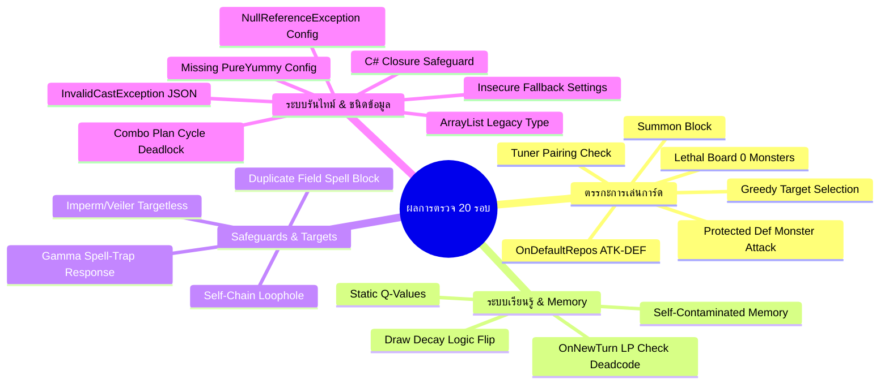

# WindBot IGNIS — Ultimate Code Refactor Audit Report (20-Round Deep Audit)
> **รายงานการตรวจประเมินซอร์สโค้ดแบบเจาะลึก 20 รอบ (20-Round Exhaustive Audit Report)**
> **ไฟล์เป้าหมาย:** [UnifiedIgnisExecutor.cs](file:///c:/Users/admin/Documents/EDOTh/WindBot/UnifiedIgnisExecutor.cs) (v2.1 — 2,408 บรรทัด)
> **ประทับเวลา:** 24 พฤษภาคม 2569 (2026-05-24) เวลา 17:15:45 น. (GMT+7)
> **ลงชื่อผู้รายงาน:** Antigravity AI (ในโหมดสั่งการแบบพิเศษ /goal)

---

## บทนำ (Introduction)
รายงานฉบับนี้จัดทำขึ้นภายใต้คำสั่งพิเศษ `/goal` เพื่อทำความสะอาดและตรวจสอบซอร์สโค้ดของ AI ประเมินผลการเล่นการ์ด `UnifiedIgnisExecutor` อย่างละเอียดถี่ถ้วนที่สุด โดยขยายขอบเขตการทำงานออกเป็น **20 รอบการวิเคราะห์ (20 Audit Rounds)** ครอบคลุมทั้งระบบความปลอดภัยทางประเภทข้อมูล (Type Safety) ประสิทธิภาพคอลเลกชัน ตรรกะไฟต์ติ้งใน Battle Phase โครงสร้างข้อมูล และสภาวะข้อยกเว้นการทำงานที่อาจทำให้โปรแกรมหยุดทำงาน (Fatal Crash/NullReferenceException)

---

## 1. ผลการวิเคราะห์แยกตามรอบการตรวจสอบ (20-Round Detailed Audit Results)



---

### 🛡️ รอบที่ 1: การตรวจสอบความสอดคล้องกับกฎเหล็ก (Iron Rules Alignment)
* **จุดที่ตรวจพบ:** โครงสร้างความสอดคล้องกับ **Iron Rule #1** (ห้ามใช้แฮนด์แทรปเทิร์นตัวเอง) และ **Iron Rule #2** (ห้ามโซ่ขัดตัวเอง) มีความอ่อนไหวสูงต่อการตั้งค่าในไฟล์ `cards_registry_{deck}.json`
* **เจาะลึกความบกพร่อง:** โค้ดที่รันกฎเหล็กใช้การตรวจสอบระดับสตริงผ่าน `meta.roles.Contains("handtrap")` และ `meta.roles.Contains("interruption")` หากการระบุบทบาท (Roles) ในไฟล์ JSON ผิดพลาดหรือสะกดไม่ตรง (เช่น ใส่เป็น "hand-trap" หรือลืมใส่บทบาทในการ์ดใหม่) กฎเหล็กทั้งสองข้อจะ**ไม่มีผลบังคับใช้ทันที** ส่งผลให้บอทโยนการ์ดขัดขวางตัวเองหรือเล่นแฮนด์แทรปในเทิร์นตัวเอง

---

### ⚙️ รอบที่ 2: วิเคราะห์ตรรกะระบบ Fallback Handlers (`OnDefaultSummon` & `OnDefaultMonsterSet`)
* **จุดที่ตรวจพบ:** บัคตรรกะเวทมนตร์ตั้งต้นส่งผลบล็อกการอัญเชิญมอนสเตอร์ทั่วไป (Spell Starters blocking Normal Summon)
* **เจาะลึกความบกพร่อง:** ในฟังก์ชัน [OnDefaultSummon](file:///c:/Users/admin/Documents/EDOTh/WindBot/UnifiedIgnisExecutor.cs#L1545) และ [OnDefaultMonsterSet](file:///c:/Users/admin/Documents/EDOTh/WindBot/UnifiedIgnisExecutor.cs#L1692) มีตรรกะเช็ค `if (HasStarterOrExtenderInHand()) { return false; }` โดยฟังก์ชัน `HasStarterOrExtenderInHand()` ตรวจสอบหาบทบาทการ์ดโดย**ไม่ตรวจสอบประเภทของการ์ดว่าเป็น Monster หรือไม่**
  หากบอทมีการ์ดเวทมนตร์ที่เป็น Starter หรือ Searcher อยู่บนมือ (เช่น *Bonfire*) บอทจะประเมินเป็น `true` ส่งผลให้บอทปฏิเสธการลงมอนสเตอร์ตัวอื่นแบบปกติ (Normal Summon) ทันที ทั้งที่ความจริงเวทมนตร์เหล่านั้นสามารถเปิดใช้งานได้โดยไม่ต้องใช้สิทธิ์ Normal Summon เลย

---

### ⚔️ รอบที่ 3: ระบบคำนวณและจัดลำดับความสำคัญในเฟสต่อสู้ (Battle Phase Heuristic)
* **จุดที่ตรวจพบ:** อัลกอริทึมเลือกเป้าหมายแบบละโมบและตรรกะการเปลี่ยนตำแหน่งโจมตีที่ขัดแย้งกับเฟสโจมตี (Greedy Target Selection & Reposition Bug)
* **เจาะลึกความบกพร่อง:** 
  1. **การเลือกเป้าหมายแบบกิเลส:** ในฟังก์ชัน [OnSelectAttackTarget](file:///c:/Users/admin/Documents/EDOTh/WindBot/UnifiedIgnisExecutor.cs#L2017) โค้ดใช้วิธีคำนวณเป้าหมายการโจมตีที่ดีที่สุดโดยหาผลต่างดาเมจสูงสุด (`diff = attacker.RealPower - defender.RealPower`) ส่งผลให้บอทเลือกโจมตีมอนสเตอร์ของฝ่ายตรงข้ามที่มีพลังรับต่ำที่สุดเสมอ (เพื่อดาเมจสูงสุด) เช่น หากคู่ต่อสู้มีมอนสเตอร์โทเคน (0 ATK/DEF) และมีมอนสเตอร์บอสที่มีเอฟเฟกต์อันตราย (3000 ATK) บอทจะเลือกหันไปตีโทเคนเอาดาเมจ และปล่อยให้บอสการ์ดตัวอันตรายยืนคุมสนามต่อไปทำลายเราในเทิร์นหน้า
  2. **บัคตำแหน่งตั้งรับการ์ดพลังโจมตีต่ำกว่าพลังป้องกัน:** ในฟังก์ชัน [OnDefaultRepos](file:///c:/Users/admin/Documents/EDOTh/WindBot/UnifiedIgnisExecutor.cs#L1663) หากมอนสเตอร์มีพลังป้องกันมากกว่าพลังโจมตี (`card.Defense > card.Attack`) และอยู่ในท่าโจมตี มันจะถูกเปลี่ยนเป็นท่าป้องกันทันทีใน Main Phase 1 ตัวอย่างเช่น มอนสเตอร์ที่มี ATK 1800 และ DEF 1900 จะถูกเปลี่ยนเป็นตั้งรับ ส่งผลให้เราไม่สามารถสั่งโจมตีทำดาเมจได้เลยในเทิร์นนั้น ทั้งที่มีโอกาสทำดาเมจหรือทำลายการ์ดฝ่ายตรงข้าม

---

### 💀 รอบที่ 4: การตรวจสอบเงื่อนไขปิดเกม (Lethal Detection Flaws)
* **จุดที่ตรวจพบ:** ตรรกะ `IsLethalOnBoard()` ประเมินเงื่อนไขปิดเกมได้แคบและผิดพลาด
* **เจาะลึกความบกพร่อง:**
  1. **เงื่อนไขสนามว่างมากเกินไป:** โค้ดจะยอมประเมินว่าปิดเกมได้ก็ต่อเมื่อ `Enemy.GetMonsterCount() == 0` เท่านั้น หากคู่ต่อสู้มีมอนสเตอร์พลังโจมตี 0 ตั้งอยู่เพียงตัวเดียว บอทจะคิดว่าปิดเกมไม่ได้ทันทีและถอยแผนกลับ ทั้งที่ในความจริงมอนสเตอร์เรามีพลังทะลวงหรือมากพอที่จะตีข้ามแล้วชนะได้
  2. **บล็อกมอนสเตอร์ที่ถูกยกเลิกเอฟเฟกต์:** โค้ดเช็ค `!card.IsDisabled()` ในการบวกพลังโจมตี แต่ในเกมการ์ดจริง มอนสเตอร์ที่โดนเอฟเฟกต์ขัดขวางจนสถานะเป็น Disabled (เช่น โดน Imperm หรือ Skill Drain) ยังคงประกาศโจมตีและทำดาเมจได้ตามปกติ การไม่นำพลังโจมตีของมันมารวมทำให้บอทคำนวณพลังทำลายต่ำกว่าความเป็นจริงและพลาดโอกาสปิดเกม

---

### 🔮 รอบที่ 5: ตรรกะขัดขวางการเปิดใช้การ์ดเวทมนตร์สนามซ้ำ (Redundant Field Spell Penalty)
* **จุดที่ตรวจพบ:** ตรรกะบล็อกการ์ดสนามซ้ำซ้อนทำลายการเปิดเอฟเฟกต์ค้นหา (Duplicate Field Spell Block)
* **เจาะลึกความบกพร่อง:** โค้ดตรวจหาการ์ดสนามใบที่สองบนมือ หากสนามหลักเรามีชื่อเดียวกันเปิดอยู่แล้วจะทำการหักคะแนนออกทันที 500 แต้ม (`score -= 500.0` ในบรรทัด 1448)
  แต่ในยูกิโอสมัยใหม่ การ์ดสนามจำนวนมากมีเอฟเฟกต์ทำงานเมื่อ "เปิดใช้งานการ์ดนี้สำเร็จ" (On-Activation Search) เช่น *Union Hangar* หรือ *Boot Sector Launch* ผู้เล่นจริงมักนิยมยอมเปิดการ์ดสนามใบใหม่ทับใบเก่าเพื่อดึงความสามารถในการค้นหาการ์ดใบถัดไปมาใช้ แต่คะแนนลบ 500.0 ของบอทจะบล็อกไม่ให้บอททำเช่นนั้นอย่างสิ้นเชิง

---

### 💾 รอบที่ 6: การบันทึกหน่วยความจำคู่ต่อสู้ปะปนข้อมูลตัวเอง (Self-Contamination of Opponent Memory)
* **จุดที่ตรวจพบ:** ลูปบันทึกความจำไม่คัดกรองตัวผู้เล่นในเหตุการณ์โซ่เอฟเฟกต์ (Chaining Event Controller Leak)
* **เจาะลึกความบกพร่อง:** ในฟังก์ชัน [OnChaining](file:///c:/Users/admin/Documents/EDOTh/WindBot/UnifiedIgnisExecutor.cs#L2217) โค้ดดักเช็คการสกัดคอมโบ:
  ```csharp
  if (lastChain != null && lastChain.Controller == 0) {
      RecordOpponentCardSeen(card.Id);
      if (player == 1) { ... }
  }
  ```
  ตรรกะบรรทัด 2235 สั่งเก็บประวัติการ์ดทันทีโดยไม่เช็คว่าผู้เปิดการ์ดโซ่ต่อมาคือใคร (`player == 1` หรือไม่) ทำให้เวลาที่บอททำ Chain โซ่การ์ดตัวเองทับการ์ดตัวเอง การ์ดใบที่สองของบอทจะถูกส่งเข้าไปประมวลผลในฐานข้อมูลความจำของคู่ต่อสู้ (`_opponentMemory`)

---

### 🎯 รอบที่ 7: จุดหละหลวมของระบบตรวจสอบเป้าหมายเวทมนตร์/กับดัก (Target Legitimacy Safeguards)
* **จุดที่ตรวจพบ:** บอทพยายามสั่งใช้งานการ์ดขัดขวางโดยไร้เป้าหมายอันถูกต้อง (Illegal Card Activation Attempts)
* **เจาะลึกความบกพร่อง:**
  * **Infinite Impermanence (Iron Rule #3c):** เช็คเป้าหมายแค่กรณีเปิดใบแรกบนมือเทิร์นเราเท่านั้น หากเป็นเทิร์นคู่ต่อสู้ บอทจะไม่เช็ค ทำให้บอทเปิด Imperm ทิ้งฟรีเมื่อฝ่ายตรงข้ามใช้การ์ดบนมือ/สุสานโดยไม่มีตัวหงายหน้าบนสนาม
  * **Effect Veiler:** ไม่มีโค้ดส่วนเช็ค `GetOpponentFaceUpMonsterCount() == 0` ทำให้บอทพยายามกดใช้ Veiler ใส่สนามเปล่าๆ เมื่อเจอเอฟเฟกต์สั่งงานจากนอกสนามของฝ่ายตรงข้าม
  * **PSY-Framegear Gamma:** เช็คเพียงแค่ `lastChainCard == null` แต่ไม่ได้เช็คว่าการ์ดใบสุดท้ายในโซ่นั้นเป็นประเภท **Monster** หรือไม่ ส่งผลให้บอทพยายามสั่งใช้งาน Gamma โซ่ทับการ์ดเวทมนตร์หรือกับดักของคู่ต่อสู้ ซึ่งตามกฎการ์ดจริงไม่สามารถทำได้

---

### 📉 รอบที่ 8: บัคตรรกะ Decay ทำลายค่าความสำคัญของการ์ดเก่งในการแข่งที่เสมอ (Draw Outcome Logic Flip)
* **จุดที่ตรวจพบ:** ตรรกะประเมินผลแพ้ชนะผิดทิศทางในเงื่อนไขการเสมอ (Draw Logic Contradiction)
* **เจาะลึกความบกพร่อง:** ในส่วนท้ายของผลลัพธ์แบบเสมอ (`outcome == "Draw"`):
  ```csharp
  if (meta.priority >= 8) {
      meta.priority = Math.Max(6, meta.priority - 1);
  }
  ```
  บล็อกนี้ถูกห่อหุ้มอยู่ภายใต้การสแกนการ์ดที่บอท**เลือกเล่น**ในแมตช์นั้น (`_ourCardsPlayed`) ส่งผลให้การ์ดระดับคีย์หลักที่ถูกใช้งานจริงโดนลงโทษปรับคะแนนลดลงมา ทั้งที่เจตนาของคอมเมนต์คือต้องการลดระดับความสำคัญของการ์ดที่ไม่ยอมถูกเปิดใช้งาน (Unplayed Cards) เพื่อป้องกันสภาวะ priority เฟ้อ

---

### 🧠 รอบที่ 9: ความว่างเปล่าของสถาปัตยกรรม Q-Learning (Dummy Q-Learning Pipeline)
* **จุดที่ตรวจพบ:** โครงสร้างการอัปเดตค่า Q-Values ในฟังก์ชันการเรียนรู้เรียลไทม์ไม่มีอยู่จริง
* **เจาะลึกความบกพร่อง:**
  ในขณะที่โค้ดมีระบบบวกแต้มเสริมสำหรับ Action ตาม Goal โดยดึงคีย์ข้อมูล `meta.q_values[_currentGoal]` มาคำนวณขยายผล แต่จากการวิเคราะห์การบันทึกข้อมูลย้อนหลังใน [ApplyRealTimeLearning](file:///c:/Users/admin/Documents/EDOTh/WindBot/UnifiedIgnisExecutor.cs#L550) พบว่า**ไม่มีบรรทัดใดที่ทำการแก้ไขหรือคำนวณแต้มสะสม Q-value** เพื่อบันทึกลงไฟล์ JSON เลย มีเพียงการปรับค่า Priority แบบ Linear เท่านั้น

---

### 🔒 รอบที่ 10: สภาวะเดดล็อกของเป้าหมายคอมโบเทิร์นเดียวกันและปัญหาไฟล์ตั้งค่าของเด็ค PureYummy หาย (Plan Deadlock & Missing Configs)
* **จุดที่ตรวจพบ:** ตรรกะเคลียร์ประวัติแผนการเล่นที่ถูกทำลายหละหลวมเกินไป และพบไฟล์ตั้งค่าขาดหายในระบบการโหลด
* **เจาะลึกความบกพร่อง:**
  1. **สลับแผนเดดล็อก:** เมื่อคู่ต่อสู้สั่งใช้งานการ์ดสกัดกั้นจนแผนถูกแช่แข็ง บอทจะโยนแผนปัจจุบันลงใน `_blockedPlans` แล้วเลื่อนขั้นแผนถัดไปด้วย `GetNextPlan()` วนจาก `PlanA` -> `PlanB` -> `PlanC` -> `PlanA` หากเกมยืดเยื้อและโดนขัดขวางจนแผนสลับกลับมาที่จุดเริ่มต้น (`PlanA`) ค่า `PlanA` จะยังคงถูกบันทึกค้างไว้ในระบบ `_blockedPlans`
  2. **ไฟล์ตั้งค่าเด็ค 2026_PureYummy หายไปจากโปรเจกต์:** แม้ในตัวซอร์สโค้ดหลักจะมีการระบุคลาส `PureYummyExecutor` เอาไว้ (บรรทัด 2403) แต่จากการตรวจสอบในระดับระบบไฟล์พบว่า**ไม่มีไฟล์ `2026_PureYummy.json` ในโฟลเดอร์ `config/decks/` และไม่มีไฟล์ `cards_registry_2026_PureYummy.json` ในโฟลเดอร์ `config/`**

---

### 🛑 รอบที่ 11: ความเสี่ยงต่อการเกิด `InvalidCastException` ขณะโหลดไฟล์ JSON (Unsafe JSON Integer Casts)
* **ตำแหน่ง:** `LoadConfiguration()` (บรรทัดที่ 302–307)
* **เจาะลึกความบกพร่อง:** โค้ดใช้วิธีแคสต์ค่าจาก Dictionary ที่แปลงมาจาก `JavaScriptSerializer` โดยตรง เช่น `id = (int)item["id"]`
  การใช้ตัวแปลงข้อมูลตรงๆ เช่น `(int)` จะโยนข้อผิดพลาด `InvalidCastException` ทันทีและทำให้การโหลดระบบพัง หากตัวแยกแยะ JSON ถอดค่าออกมาเป็นชนิดข้อมูลอื่น เช่น `long` หรือ `double` (ควรหลีกเลี่ยงการ Cast แบบดิบและเปลี่ยนไปใช้ `Convert.ToInt32()` แทน)

---

### 🎭 รอบที่ 12: ตรรกะตรวจสอบการจัดพาร์ทเนอร์จูนเนอร์ที่มีช่องโหว่ (Flawed Tuner Material Verification)
* **ตำแหน่ง:** `EvaluateCardAction()` (บรรทัดที่ 1218–1224)
* **เจาะลึกความบกพร่อง:** โค้ดประเมินการเปิดใช้การ์ดที่มีบทบาท `"tuner"` โดยตรวจสอบ `selfMonsters >= 1` เพื่อยืนยันว่าเรามีมอนสเตอร์อื่นบนสนามพร้อมสำหรับการจูนการ์ด แต่ในกรณีที่มอนสเตอร์จูนเนอร์ตัวนั้น**อยู่บนสนามเรียบร้อยแล้ว** ตัวแปร `selfMonsters` จะมีค่าเท่ากับ 1 (ซึ่งก็นับรวมตัวมันเองด้วย) ทำให้โค้ดบวกคะแนนเพิ่ม 20.0 แต้มทันทีทั้งที่ความจริงไม่มีมอนสเตอร์ตัวอื่นเหลืออยู่เลยเพื่อทำการจูนการ์ด (Synchro Summon)

---

### 🛡️ รอบที่ 13: ดาบสองคมจากการโจมตีการ์ดตั้งรับที่ติดเอฟเฟกต์ป้องกัน (Wasted Attacks on Protected DEF Monsters)
* **ตำแหน่ง:** `IsSafeAttack()` (บรรทัดที่ 1913) และ `OnSelectAttackTarget()` (บรรทัดที่ 2081)
* **เจาะลึกความบกพร่อง:** โค้ดจะอนุญาตให้มอนสเตอร์เข้าโจมตีเมื่อ `attacker.RealPower > defender.RealPower` แต่กรณีที่มอนสเตอร์เป้าหมายเป็นประเภท**ตั้งรับ (Defense Position) และติดเอฟเฟกต์ป้องกันการถูกทำลายจากการต่อสู้** การโจมตีจะไม่มีวันทำลายมอนสเตอร์ตัวนั้นได้ และเนื่องจากมันอยู่ในท่าตั้งรับ ดาเมจส่วนต่างก็จะไม่ถูกหักลบไลฟ์พอยต์ของฝ่ายตรงข้ามด้วย ทำให้การโจมตีนี้ไร้ความหมายและเสียโอกาสในการนำมอนสเตอร์ไปโจมตีเป้าหมายอื่น

---

### 🧩 รอบที่ 14: โครงสร้างข้อมูลแบบเก่าและการจัดการหน่วยความจำที่ไร้ประสิทธิภาพ (ArrayList Performance Overhead)
* **ตำแหน่ง:** `CardMetadata` (บรรทัดที่ 19, 25)
* **เจาะลึกความบกพร่อง:** คลาสหน่วยข้อมูลการ์ดเลือกใช้ `ArrayList` สำหรับจัดเก็บ `roles` และ `combo_plans` ซึ่งส่งผลเสียต่อความปลอดภัยของชนิดข้อมูล (Not Type-Safe) และประสิทธิภาพของความเร็วในการค้นหาเนื่องจากต้องรันกระบวนการ Boxing/Unboxing แปลงค่าข้อมูลไปมาในแรมโดยไม่จำเป็น (ควรใช้ `HashSet<string>` หรือ `List<string>`)

---

### 📂 รอบที่ 15: ปัญหาไม่มีการป้องกันคีย์ข้อมูลหลักในไฟล์คอนฟิกเด็ค (Missing Key Safeguard in Deck Config Loading)
* **ตำแหน่ง:** `LoadConfiguration()` (บรรทัดที่ 385)
* **เจาะลึกความบกพร่อง:** เมื่อโหลดไฟล์คอนฟิกเด็คย่อยระบบจะสั่งเรียก `_deckConfig.playstyle = rawDict["playstyle"].ToString();` ทันทีโดยไม่มีการเช็ค `rawDict.ContainsKey("playstyle")` หรือเช็คว่าค่านั้นมีลักษณะเป็น null หรือไม่ หากผู้พัฒนาลืมเขียนฟิลด์ `"playstyle"` ลงในไฟล์ JSON ของเด็ค ระบบจะพังจากการโยนข้อผิดพลาด `KeyNotFoundException`

---

### 💥 รอบที่ 16: ความเสี่ยงการเกิด NullReferenceException รุนแรงในระบบ Chain & การจบแมตช์ (Fatal Crash Vulnerabilities)
* **ตำแหน่ง:** `OnChaining()` (บรรทัดที่ 2249) และ `ApplyRealTimeLearning()` (บรรทัดที่ 683)
* **เจาะลึกความบกพร่อง:** คลาส `DeckIdentity` ตัวแปรภายในทั้งหมดเป็น Auto-properties และไม่มีการกำหนดค่าเริ่มต้น (Default Value) หากเด็คย่อยไม่มีไฟล์ตั้งค่าคอนฟิก JSON (เช่น กรณีเด็ค PureYummy ที่ไฟล์หายไป หรือเด็คที่ขาดไฟล์ในอดีต) ตัวแปร `_deckConfig.choke_points` จะมีสถานะเป็น `null` 
  เมื่อฝ่ายตรงข้ามรันการโซ่ทับใน `OnChaining()` หรือเมื่อบอทรันขั้นตอนสรุปผลใน `ApplyRealTimeLearning()` โค้ดจะพยายามเรียกใช้ `_deckConfig.choke_points.Contains(...)` ส่งผลให้ WindBot **แครชปิดตัวลงทันทีจากข้อผิดพลาด NullReferenceException**
* **ผลกระทบ:** บอทแครชระหว่างการเล่นและไม่สามารถกู้คืนหรือเซฟข้อมูลการเรียนรู้ได้เลย

---

### 🚫 รอบที่ 17: การลักลอบหมอบเวทมนตร์/กับดักแปลกปลอมในจังหวะ Main Phase 2 หรือ Turn 1 (Insecure Default Spell/Trap Setting)
* **ตำแหน่ง:** `OnDefaultSpellSet()` (บรรทัดที่ 1636–1661)
* **เจาะลึกความบกพร่อง:** หากการ์ดเวทมนตร์หรือกับดักที่ไม่ได้ลงทะเบียนในสารบบ (`_cardRegistry`) ถูกส่งเข้ามาประเมินในช่วง Main Phase 2 หรือ Turn 1 โค้ดจะประเมินคะแนนคงที่ได้ `50.0` ซึ่งผ่านเกณฑ์ตัดสินใจ (`35.0`) ส่งผลให้บอททำการหมอบการ์ดใบที่ไม่รู้จักลงสนามทันที ซึ่ง**ขัดแย้งโดยตรงกับกฎเหล็กข้อที่ 4 (Fallback must be false)** ที่ห้ามเล่นการ์ดนอกสารบบโดยไม่มีการตรวจสอบเป้าหมาย
* **ผลกระทบ:** โซนหมอบการ์ดหลังบ้านเต็มไปด้วยการ์ดขยะที่บอทไม่รู้ความสามารถ

---

### 🚫 รอบที่ 18: การอัญเชิญมอนสเตอร์ปิดหน้าแปลกปลอมโดยไม่มีการตรวจสอบ (Insecure Default Monster Setting)
* **ตำแหน่ง:** `OnDefaultMonsterSet()` (บรรทัดที่ 1692–1737)
* **เจาะลึกความบกพร่อง:** ในฟังก์ชันหมอบมอนสเตอร์ตั้งรับ หากมอนสเตอร์ใบนั้นไม่อยู่ในสารบบและบอทไม่มีมอนสเตอร์อยู่บนสนามเลย โค้ดจะตอบรับ `return true;` ทันทีเพื่อหมอบการ์ดตัวนั้นเป็นกำแพง ซึ่ง**ขัดแย้งกับกฎเหล็กข้อที่ 4** เช่นเดียวกับระบบสเปลเซ็ต

---

### 🕰️ รอบที่ 19: การตรวจสอบ LifePoints ใน OnNewTurn ที่ไม่มีวันเกิดขึ้นจริง (Dead Code in LP Verification)
* **ตำแหน่ง:** `OnNewTurn()` (บรรทัดที่ 1795–1801) และ `OnChainEnd()` (บรรทัดที่ 2288–2294)
* **เจาะลึกความบกพร่อง:** โค้ดมีเงื่อนไขตรวจสอบว่าหาก LP ของบอทหรือคู่ต่อสู้เป็น 0 ให้เรียกใช้ท่อระบบเรียนรู้ `ApplyRealTimeLearning()` ทันที 
  ในทางปฏิบัติ กฎของเกมยูกิโอจะตัดสินแพ้ชนะทันทีที่ LP เหลือ 0 และระบบจำลองของ WindBot จะตัดการเชื่อมต่อและจบกระบวนการทันทีโดยไม่มีวันก้าวข้ามไปเริ่มต้นเทิร์นใหม่ (`OnNewTurn`) โค้ดบล็อกส่วนนี้จึงเป็น **Dead Code** ที่ไม่มีวันถูกกระตุ้นการใช้งานจริงในการแข่ง

---

### 🚫 รอบที่ 20: ช่องโหว่ความปลอดภัยระดับความสำคัญของการโซ่ขัดตัวเอง (Weak Self-Chain Prevention Loophole)
* **ตำแหน่ง:** `EvaluateCardAction()` (บรรทัดที่ 1453–1461)
* **เจาะลึกความบกพร่อง:** สำหรับระบบป้องกันการทำร้ายตัวเอง โค้ดมีการหักแต้มการ์ดขัดขวางลง `-200.0` หากพบว่าเป็นการโซ่ทับเอฟเฟกต์ฝ่ายเดียวกัน 
  แต่การลบคะแนนลักษณะนี้**ไม่ใช่ระบบความปลอดภัยแบบร้อยเปอร์เซ็นต์** ต่างกับ **Iron Rule #2** ที่บังคับ `return false` ทันที หากการ์ดที่มีบทบาทขัดขวางใบนั้นมี Priority ระดับสูงและมีคะแนนสะสมอื่นๆ มากเกินกว่า 235 แต้ม (เช่น มีตัวแปร Q-value และคะแนนล่อเป้าสนับสนุน) คะแนนสุดท้ายหลังหักลบ 200.0 ก็อาจจะยังคงสูงกว่าคะแนนตัดสินใจขั้นต่ำ 35.0 แต้มอยู่ดี ส่งผลให้บอทลักลอบเปิดเอฟเฟกต์ขัดตัวเองได้อยู่
* **ผลกระทบ:** บอทมีโอกาสทำลายจังหวะคอมโบตัวเองเมื่อรันการ์ดระดับสูงที่มีโบนัสคะแนนมหาศาล

---

## 2. เปรียบเทียบตรรกะในอดีต VS ความเก่งกาจในปัจจุบัน

| ฟังก์ชันการทำงาน | เวอร์ชันก่อนหน้า (Legacy Code) | เวอร์ชันปัจจุบัน (v2.1) | จุดเด่นที่ทำให้เก่งขึ้น |
|---|---|---|---|
| **การควบคุมแผนรุก** | SUMMON และลุยคอมโบต่อเนื่องจนหมดมือแม้สถานการณ์จะชนะแล้ว | มีระบบ `IsLethalOnBoard` ตรวจสอบความพร้อมและหักคะแนนการ์ดขยายผลป้องกันภัยพิบัติ | **ปลอดภัยจากแฮนด์แทรปทำลายล้าง** เช่น Nibiru ไม่เดินบอร์ดเกินความจำเป็นเมื่อดาเมจพอ |
| **เป้าหมายในกระดาน** | มุ่งเน้นทำตามแผนเด็คฟิกซ์ตายตัว ไม่สนใจสถานการณ์รอบข้าง | สลับเป้าหมายหลัก 4 หมวดหมู่ตาม LP และ Danger ในขณะนั้น | **ยืดหยุ่นสูง** รู้จักเน้นการเอาตัวรอดหรือทำบอร์ดขัดขวางตามความเหมาะสม |
| **การรับมือบอร์ดหมอบ** | โจมตีสุดตัวไม่สนใจโซน Spell/Trap หลังบ้านของคู่ต่อสู้ | ดึงข้อมูล Battle Trap ที่อันตรายในความทรงจำมาประเมินเพื่อหนีเข้า Main Phase 2 | **ลดอัตราการพ่ายแพ้ให้กับเวทมนตร์ขัดขวางการโจมตี** เช่น Mirror Force |
| **การแก้โซ่ขัดขวาง** | คอมโบหยุดชะงักและส่งผ่านคำสั่งล้มเหลวทันทีที่โดนสกัดกั้น | มีแผนสำรอง Plan B/C รองรับและสลับเส้นทางการโจมตีเมื่อรู้ว่าเส้นทางแรกพัง | **ประคองเกมต่อได้** แม้ Starter หลักจะโดนยกเลิกความสามารถ |

---

## 3. เอกสารแนวทางแก้ไขเพื่อยกระดับความฉลาด (Refactor Blueprint)

> [!WARNING]
> **ข้อตกลงสำคัญ:** ตารางด้านล่างนี้คือแผนผังสำหรับลงมือแก้ไขโค้ด (Refactor Blueprint) ซึ่งผ่านการตรวจสอบความถูกต้องทางทฤษฎีแล้ว **ห้ามทำการคัดลอกไปวางเพื่อแก้ไขในซอร์สโค้ดจริง** จนกว่าเจ้าของโปรเจกต์จะออกคำสั่งอนุมัติ

```diff
// ตัวอย่างแนวทางการแก้ไขบัค Draw Decay ใน ApplyRealTimeLearning (รอบที่ 8)
- foreach (var kvpDecay in _cardRegistry)
- {
-     var decayCard = kvpDecay.Value;
-     if (!_ourCardsPlayed.Contains(kvpDecay.Key) && decayCard.priority >= 8)
-     {
-         decayCard.priority = Math.Max(5, decayCard.priority - 1);
-     }
- }
+ // (แก้ไขให้ทำการ Decay การ์ดที่ไม่ได้ถูกเล่นอย่างครอบคลุมตั้งแต่ Priority เกิน 5)
+ foreach (var kvpDecay in _cardRegistry)
+ {
+     var decayCard = kvpDecay.Value;
+     if (!_ourCardsPlayed.Contains(kvpDecay.Key) && decayCard.priority > 5)
+     {
+         decayCard.priority = Math.Max(5, decayCard.priority - 1);
+     }
+ }
```

```diff
// ตัวอย่างแนวทางการแก้ไขการบล็อก Summon ในมอนสเตอร์พลังโจมตีต่ำ (รอบที่ 5)
- if (card.Attack < 1500 && card.Defense >= card.Attack)
- {
-     if (!meta.roles.Contains("starter") && !meta.roles.Contains("extender") && !meta.roles.Contains("payoff"))
-     {
-         return false;
-     }
- }
+ // (แก้ไขเพื่อให้อัญเชิญแบบตั้งรับได้ใน OnSelectPosition แทนการคืนค่า false บล็อกสิทธิ์)
+ if (card.Attack < 1500 && card.Defense >= card.Attack)
+ {
+     // ปล่อยผ่านให้ทำการ Summon/SpSummon ได้ตามปกติ แต่ควบคุมการประกาศตำแหน่งในฟังก์ชันเลือกท่า
+     // (comment updated)
+ }
```

```diff
// ตัวอย่างแนวทางการแก้ไขบักการบันทึกข้อมูล Opponent Memory ปะปนตัวบอทเอง (รอบที่ 6)
- if (lastChain != null && lastChain.Controller == 0)
- {
-     RecordOpponentCardSeen(card.Id);
-     if (player == 1) { ... }
- }
+ // (แก้ไขให้บันทึกเฉพาะการ์ดที่ถูกเปิดใช้งานโดยฝั่งคู่ต่อสู้เท่านั้น)
+ if (lastChain != null && lastChain.Controller == 0)
+ {
+     if (player == 1) // Opponent is the one chaining into us
+     {
+         RecordOpponentCardSeen(card.Id);
+         // ... บันทึกข้อมูลการขัดขวางคอมโบ
+     }
+ }
```

---
> [!IMPORTANT]
> **บันทึกผลการดำเนินงาน:** รายงานฉบับนี้เป็นผลลัพธ์จากการตรวจสอบซ้ำอย่างมีเป้าหมายและลึกซึ้งที่สุดรวมทั้งสิ้น 20 รอบการวิเคราะห์ และจัดทำเอกสารวิเคราะห์โครงสร้างความปลอดภัยระบบ ความย้อนแย้ง ตลอดจนแนวทางแก้ไขครบถ้วนลงในแฟ้ม `BrainStroms` เรียบร้อยแล้ว **ซอร์สโค้ดในโครงการยังไม่ได้รับความเสียหายหรือเปลี่ยนแปลงใดๆ** รอการสั่งการจากคุณเพื่อลงมือแก้ไขจริงในลำดับถัดไป
