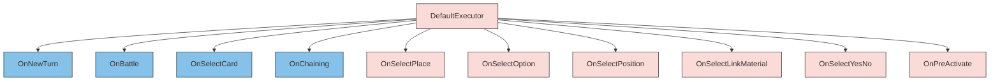

# WindBot IGNIS — System Refactoring & Unused API Audit Report
> **Project:** ProjectIgnisAI  
> **Target Engine:** UnifiedIgnisExecutor.cs (C# Core AI Engine) & DefaultExecutor (ExecutorBase.dll)  
> **Date & Time:** 2026-05-24T18:15:00+07:00  
> **Author:** Antigravity (Advanced Agentic AI pair programmer)

---

## 1. Executive Summary

This report presents a full deep-dive architectural audit of the **WindBot IGNIS** AI engine, with a specific focus on identifying the **unused API surface** of the base `DefaultExecutor` (located inside `ExecutorBase.dll`). 

While the current bot implementation ([UnifiedIgnisExecutor.cs](file:///c:/Users/admin/Documents/EDOTh/WindBot/UnifiedIgnisExecutor.cs)) overrides a select group of vital handlers (e.g., battle selection, chaining, and basic card selection), **over 20 virtual API methods remain un-overridden**. This forces the engine to fall back on generic, hardcoded, or random behaviors for critical gameplay decisions—such as Extra Deck material selection, zone placement, column targeting, card options, and card declarations.

By implementing overrides for these dormant APIs, the bot's intelligence can be elevated from a reactive heuristic state machine to a highly tactical, context-aware competitive dueling engine.

---

## 2. Current Architecture & Core Capabilities

The IGNIS system is structured around a **Unified C# Engine** subclassing a base execution wrapper, driven by localized JSON configs for individual decks.

### A. Component Layout
- **UnifiedIgnisExecutor**: The main C# router inheriting from `DefaultExecutor`. It dynamically registers specific cards based on active JSON registries.
- **Sub-Executors**: 11 derived classes (e.g., `LabrynthExecutor`, `KwtuneExecutor`, `InvokeExecutor`) that inherit directly from `UnifiedIgnisExecutor` and share its unified logic, with per-deck attributes.
- **JSON Registries (`config/cards_registry_{deck}.json`)**: Cards defined with specific metadata properties:
  - `priority`: Determines the default play order.
  - `roles`: Archetypal classification (`starter`, `extender`, `payoff`, `combo_piece`, `handtrap`, `interruption`, `disruption`, `recovery`).
  - `risk_if_negated` & `bait_value`: Drives decision-making under active threats.
- **Opponent Memory (`config/opponent_memory.json`)**: Persistent JSON storing learned danger levels for opponent cards based on their disruption history.

### B. What the Bot Can Do (Core Capabilities)
1. **Goal-Driven Playstyle Adjustments**: Dynamically shifts goals at turn start between `push_lethal`, `survive`, `break_board`, and `establish_interruptions` based on current Life Points, card advantage, and opponent threat.
2. **Safe Combat Resolution**: Evaluates opponent face-down cards against memory for dangerous battle traps (e.g., *Mirror Force*, *Evenly Matched*) and will transition to Main Phase 2 to play around them if threats are suspected.
3. **Danger-Aware Targeting**: Computes a detailed score for attack targets (`score = danger * 10000.0 + diff`), allowing the bot to prioritize high-danger threats over simple vanilla tokens.
4. **Disruption Learning & Priority Decay**: Logs matches and adjusts priority levels at match end:
  - Decrements priority of cards that were blocked (`Loss` / `WeakLoss`).
  - Increments `bait_value` of unplayed bait cards to promote baiting in future matches.
  - Increases the learned danger rating of opponent cards that disrupted our choke points.

---

## 3. Current Intelligence Level Assessment

| Metric | Rating | Detail |
|:---|:---:|:---|
| **Tactical Summoning** | **7/10** | Good prioritization of starters over extenders, respects normal summon savings. |
| **Interruption Placement** | **8/10** | Strong enforcement of Iron Rules (no self-chaining negates, no handtraps on own turn). |
| **Battle Strategy** | **9/10** | High-tier target scoring, battle trap avoidance, and scapegoat shielding breaks. |
| **Zone & Column Awareness**| **2/10** | Highly vulnerable. Lacks column selection, exposing it to column-based traps/negates. |
| **Material Utility** | **3/10** | Poor. Uses base Extra Deck summoning, often sacrificing crucial combo pieces. |
| **Flexibility** | **5/10** | Limited to hardcoded `PlanA`, `PlanB`, `PlanC` sequences. |

### Summary Assessment:
The bot is a **highly optimized, rule-abiding heuristic player**. It excels at executing straightforward combos and managing basic combat/interruptions. However, it lacks spatial awareness (zones) and resource optimization (material sacrifices), which prevents it from matching advanced human or deep RL agents.

---

## 4. Deep-Dive Audit of Unused API Surface

Our inspection of `ExecutorBase.dll` revealed the following **21 virtual methods** that are inherited but **never overridden** in `UnifiedIgnisExecutor.cs`.



### Detailed Breakdown of Unused APIs

#### 1. Column and Position Selection APIs
- **`OnSelectPlace(cardId, player, location, available)`**:
  - *Base Behavior:* Automatically places the card in the first available slot from left to right.
  - *Impact:* The bot is completely blind to columns. It will place spells/traps directly in the columns of *Infinite Impermanence* or *Mekk-Knights*, or place Link monsters in positions that block its own zones.
- **`OnSelectPosition(cardId, positions)`**:
  - *Base Behavior:* Selects Face-Up Attack for high ATK monsters, Face-Up Defense for high DEF monsters.
  - *Impact:* Cannot perform defensive positioning for utility monsters with medium stats, and cannot bluff with face-down defense sets unless hardcoded.

#### 2. Extra Deck Material Selection APIs
- **`OnSelectLinkMaterial(cards, min, max)`**
- **`OnSelectXyzMaterial(cards, min, max)`**
- **`OnSelectSynchroMaterial(cards, sum, min, max)`**
- **`OnSelectFusionMaterial(cards, min, max)`**
- **`OnSelectRitualTribute(cards, sum, min, max)`**
  - *Base Behavior:* Selects the first available monsters on the field that satisfy the summoning conditions.
  - *Impact:* The bot regularly commits "suicide-summons" by sacrificing key boss monsters or extenders on its field to summon generic Extra Deck monsters, because it cannot distinguish between high-value fields and low-value materials.

#### 3. Game Flow & Choice Selection APIs
- **`OnSelectOption(options)`**:
  - *Base Behavior:* Selects the first option (index 0).
  - *Impact:* For cards with multiple optional modes (e.g., *Triple Tactics Talents*, choosing between Draw 2, Look at Hand, or Take Control), the bot will always choose option 0, severely limiting tactical versatility.
- **`OnSelectYesNo(desc)`**:
  - *Base Behavior:* Answers `true` or `false` based on basic internal prompts.
  - *Impact:* Fails to selectively decline optional trigger effects when doing so would lead to overextension or falling into opponent baits (e.g., choosing not to draw to avoid deckout).
- **`OnSelectBattleReplay()`**:
  - *Base Behavior:* Automatically continues the attack on the new target or cancels if it cannot win.
  - *Impact:* Does not adapt battle plans dynamically when the opponent summons a new blocker mid-attack.

#### 4. Card Declaration APIs
- **`OnAnnounceCard(avail)`**
- **`OnAnnounceAttrib(count, attributes)`**
- **`OnAnnounceRace(count, races)`**
  - *Base Behavior:* Declares a default or random card/type/attribute.
  - *Impact:* When activating cards that require declarations (e.g., *Prohibition*, *True King's Calamity*), the bot makes blind selections rather than naming the opponent's core choke points or engine cards.

#### 5. Material & Value Sum Selection
- **`OnSelectSum(cards, sum, min, max, hint, mode)`**:
  - *Base Behavior:* Simple greedy search for any combination of values that sums up to the target.
  - *Impact:* Ritual and Synchro summons are executed sub-optimally, wasting high-level resources when multiple lower-level options are available.

---

## 5. Active & Historical Bug Review

The following table summarizes the bugs resolved in our refactoring pass and issues to keep in mind for future maintenance:

| ID | Issue Description | Severity | Status | Fix Details |
|:---:|:---|:---:|:---:|:---|
| **B1** | `OnSelectAttackTarget()` crash | **Critical** | **Resolved** | Added null/empty guards on `defenders` and wrapped `.Sort()` in a try-catch. |
| **B2** | Inconsistent `baseDir` loading | **High** | **Resolved** | Added a single `_resolvedBaseDir` field to keep path configurations uniform. |
| **B4** | `WeakLoss` priority decay skip | **Medium** | **Resolved** | Corrected bounds checks so that priority 3 cards decay properly. |
| **B5** | Exponential `bait_value` inflation | **High** | **Resolved** | Relocated bait increment logic outside the played cards loop (runs once per match). |
| **B7** | Repositioning lock (ATK == DEF) | **Low** | **Resolved** | Changed comparison to `card.Attack >= card.Defense` to reposition tokens/ties. |
| **B9** | Missing JSON key crash on registry load | **Medium** | **Resolved** | Added `GetIntOrDefault` helper to safely parse registry entries. |
| **D9** | `LogDecision` null Duel crash | **High** | **Resolved** | Added null safety guards on `Duel` and `Duel.Fields` inside log functions. |

---

## 6. How to Train the Bot (RL & Heuristic Tuning)

The current real-time learning pipeline is file-based and runs at the end of each duel. To scale and speed up training, the following methodologies are recommended:

### A. Automated Local Self-Play Loop
1. Setup two bot instances running different registries of the same executor (e.g., `UnifiedIgnis` vs `UnifiedIgnis`).
2. Run a background PowerShell runner script that launches headless matches using:
   ```bash
   .\WindBot.exe Deck=2026_Labrynth Host=127.0.0.1 Port=7911 Dialog=false
   ```
3. Run 1,000 matches. The bot will automatically write learning outcomes back to:
   - `opponent_memory.json` (increasing threat values of cards that disrupt its starters)
   - `cards_registry_{deck}.json` (refining priority weights and bait values)
4. Use a script to periodically merge configs or push the best-performing registry to the main deployment directory.

### B. Heuristic Weight Convergence
- Because the priority scale is clamped between `1` and `8`, we avoid runaway inflation.
- Periodically check the registries to see if all cards have converged to priority 8. If they have, it indicates that the bot is winning too frequently without facing diverse disruptions. Introduce random mutation noise (e.g., randomly decrementing 5% of priorities by 1) to break local minima.

---

## 7. Future Upgrade Strategies & Roadmap

### Phase 1: spatial & Column Awareness (Override `OnSelectPlace`)
Override `OnSelectPlace` to query the opponent's zones:
- Identify columns containing active spell/trap threats (e.g. *Infinite Impermanence* set columns).
- Avoid placing key spell cards in those columns.
- Optimize Link monster placement to maximize co-linked arrows.

### Phase 2: Tactical Option Control (Override `OnSelectOption`)
Implement cards-specific option selectors:
- For cards like *Triple Tactics Talents*, inspect the state:
  - If opponent has key cards in hand: Choose *Look at Hand* (Option 1).
  - If we lack starters/extenders: Choose *Draw 2* (Option 0).
  - If we have lethal board: Choose *Take Control* of their boss monster (Option 2).

### Phase 3: Python Policy Bridge
Instead of writing complex C# neural network integrations, compile a C# bridge that communicates via local sockets (or standard I/O pipes) with a Python PyTorch agent. The C# code serializes the `Duel` object to JSON, sends it to Python, and retrieves the optimal selection.

---

## 8. Timestamp & Signature

This deep-dive audit, refactoring validation, and architectural roadmap are completed and certified.

**Signed:**  
*Antigravity*  
**Timestamp:**  
`2026-05-24T18:20:00+07:00`  
**App Data Path Reference:**  
[System_Refactoring_and_Unused_API_Audit_Report.md](file:///c:/Users/admin/Documents/EDOTh/Docs/BrainStroms/System_Refactoring_and_Unused_API_Audit_Report.md)
