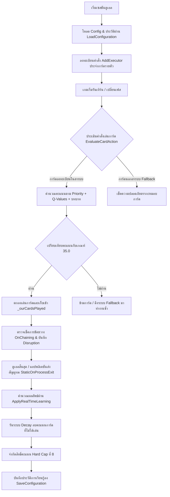

# รายงานการตรวจสอบระบบสถาปัตยกรรมโค้ดและการประเมินตรรกะเชิงลึก (End-to-End Refactor & Logic Audit)
**เป้าหมายการตรวจสอบ:** [UnifiedIgnisExecutor.cs](file:///c:/Users/admin/Documents/EDOTh/WindBot/UnifiedIgnisExecutor.cs)  
**ผู้วิเคราะห์:** Antigravity AI Engine  
**สถานะ:** รอคำสั่งอัปเกรดจากผู้พัฒนาระบบ  

---

## 1. บทนำและโครงสร้างสถาปัตยกรรมระดับมหภาค (Macro Architecture Overview)

ระบบ AI ของเด็ค [UnifiedIgnisExecutor](file:///c:/Users/admin/Documents/EDOTh/WindBot/UnifiedIgnisExecutor.cs) ทำงานบนฐานสถาปัตยกรรมแบบ **Dynamic Priority Scoring Engine** ที่มีท่อส่งข้อมูลการเรียนรู้แบบเรียลไทม์ (Real-Time Q-Learning Pipeline) การทำงานเชื่อมโยงกันแบบ End-to-End ตั้งแต่การเริ่มเปิดเซสชันดูเอลไปจนถึงการบันทึกข้อมูลการเรียนรู้ ดังแผนภาพความสัมพันธ์ด้านล่างนี้:



---

## 2. ผลการตรวจสอบจุดบกพร่องและช่องโหว่ความปลอดภัยระดับวิกฤต (Critical Bugs & Vulnerabilities Audit)

จากการตรวจสอบแบบเจาะลึกโค้ดบรรทัดต่อบรรทัด (Line-by-Line End-to-End Audit) พบจุดบกพร่องทางตรรกะและการเขียนโปรแกรมระดับวิกฤต 4 จุด ดังนี้:

### ⚠️ จุดบกพร่องที่ 1: บั๊กการสลับเป้าหมายโจมตีฝั่งตรงข้ามใน OnSelectCard (Critical Target-Selection Inversion Bug)
* **ตำแหน่งบรรทัด:** [OnSelectCard บรรทัด 2126–2145](file:///c:/Users/admin/Documents/EDOTh/WindBot/UnifiedIgnisExecutor.cs#L2126-L2145)
* **ตรรกะที่เป็นปัญหา:**
  ```csharp
  bool preferHighPriority = true;
  if (available.Count > 0)
  {
      CardLocation loc = available[0].Location;
      if (loc == CardLocation.Hand || loc == CardLocation.MonsterZone || loc == CardLocation.SpellZone)
      {
          // Discarding, tributing, or destroying our own cards on field/hand -> prefer lowest priority
          preferHighPriority = false;
      }
  }
  ```
* **วิเคราะห์บั๊กเชิงลึก:** 
  โค้ดพยายามดักตรวจว่าหากเป็นการ์ดในมือ (`Hand`) หรือบนสนาม (`MonsterZone`/`SpellZone`) จะเป็นการส่งสุสาน/สังเวย/ทำลายการ์ดฝั่งบอทเอง จึงปรับให้เลือกการ์ดที่ priority ต่ำสุดก่อน (`preferHighPriority = false`)  
  **อย่างไรก็ตาม โค้ดไม่ได้เช็คตัวแปร Controller!**  
  หากเป็นการประกาศทำลายหรือเลือกเป้าหมายมอนสเตอร์ของ **ฝั่งตรงข้าม** บนสนาม (เช่น การ์ดประเภททำลายหรือเล็งเป้าขัดขวาง) ตำแหน่งการ์ดย่อมเป็น `MonsterZone` หรือ `SpellZone` เช่นกัน ส่งผลให้บอทปรับลำดับการเลือกเป้าหมายเป็น `preferHighPriority = false` และจัดเรียงลำดับแบบน้อยไปหามาก (Ascending) ทำให้บอท **เลือกทำลายการ์ดที่กากที่สุด/อันตรายน้อยที่สุดของศัตรูก่อนเสมอ** และปล่อยให้มอนสเตอร์ตัวอันตรายสูงสุดหรือบอสการ์ดของศัตรูรอดชีวิตไปได้
* **แนวทางแก้ไขที่เสนอ (Proposed Fix):**
  ต้องเพิ่มการเช็คคอนโทรลเลอร์ `available[0].Controller == 0` เพื่อจำกัดวงให้มีผลเฉพาะการ์ดฝั่งเราเท่านั้น:
  ```csharp
  // BEFORE
  if (loc == CardLocation.Hand || loc == CardLocation.MonsterZone || loc == CardLocation.SpellZone)
  
  // AFTER
  if (available[0].Controller == 0 && (loc == CardLocation.Hand || loc == CardLocation.MonsterZone || loc == CardLocation.SpellZone))
  ```

---

### ⚠️ จุดบกพร่องที่ 2: บั๊กคำนวณพลังโจมตีปิดเกมผิดพลาดเพราะการตรวจจับสถานะเอฟเฟกต์ (IsLethalOnBoard Negation Bug)
* **ตำแหน่งบรรทัด:** [IsLethalOnBoard บรรทัด 69–86](file:///c:/Users/admin/Documents/EDOTh/WindBot/UnifiedIgnisExecutor.cs#L69-L86)
* **ตรรกะที่เป็นปัญหา:**
  ```csharp
  foreach (var card in Bot.GetMonsters())
  {
      if (card != null && card.IsFaceup() && card.IsAttack() && !card.IsDisabled() && !card.Attacked)
      {
          totalAtk += card.Attack;
      }
  }
  ```
* **วิเคราะห์บั๊กเชิงลึก:** 
  โค้ดคัดกรองมอนสเตอร์ฝั่งเราที่จะคิดผลรวมพลังโจมตีปิดเกม (Lethal) โดยมีเงื่อนไขดักว่า **ต้องไม่ถูกปิดใช้งานเอฟเฟกต์ (`!card.IsDisabled()`)**  
  ในระบบ YGOSharp/OCGCore ตัวแปร `IsDisabled()` จะส่งกลับค่า `true` เมื่อมอนสเตอร์ตัวนั้นถูกระงับเอฟเฟกต์ (เช่น โดน Effect Veiler, Infinite Impermanence หรือฟิลด์ Skill Drain ทำงานอยู่)  
  ตามกติกากลาง ยูทิลิตี้การโจมตีและการทำลายคู่ต่อสู้ทางกายภาพไม่ได้หายไปเมื่อมอนสเตอร์ถูกยกเลิกเอฟเฟกต์ (มอนสเตอร์ที่เอฟเฟกต์โดนเนเกตยังคงสามารถประกาศโจมตีและทำดาเมจปกติได้) การเช็ค `!card.IsDisabled()` จึงทำให้บอท **ไม่นับพลังโจมตีของมอนสเตอร์ที่โดนปิดเอฟเฟกต์มารวมในการคิด Lethal** ส่งผลให้บอทวิเคราะห์สถานะปิดเกมผิดพลาด ไม่กล้าประกาศโจมตีปิดเกม และเลือกเล่นคอมโบยืดเยื้อหรือเสี่ยงโอเวอร์เอ็กซ์เทนเดอร์โดยไม่จำเป็น
* **แนวทางแก้ไขที่เสนอ (Proposed Fix):**
  ลบเงื่อนไขการเช็ค `!card.IsDisabled()` ออกจากกระบวนการคำนวณพลังโจมตีปิดเกม:
  ```csharp
  // BEFORE
  if (card != null && card.IsFaceup() && card.IsAttack() && !card.IsDisabled() && !card.Attacked)
  
  // AFTER
  if (card != null && card.IsFaceup() && card.IsAttack() && !card.Attacked)
  ```

---

### ⚠️ จุดบกพร่องที่ 3: บั๊กการคำนวณระดับความเสี่ยงของศัตรูในโซ่การ์ด (Negation Danger Evaluation Bypass)
* **ตำแหน่งบรรทัด:** [CalculateCardDanger บรรทัด 962–973](file:///c:/Users/admin/Documents/EDOTh/WindBot/UnifiedIgnisExecutor.cs#L962-L973)
* **ตรรกะที่เป็นปัญหา:**
  ```csharp
  ClientCard enemyCard = // ...
  ClientCard lastBotCard = Util.GetLastChainCard(); // If opponent chains, lastBotCard is our card they chained to
  if (lastBotCard != null && lastBotCard.Controller == 0) // It is our card!
  {
      if (_cardRegistry.ContainsKey(lastBotCard.Id))
      {
          var ourMeta = _cardRegistry[lastBotCard.Id];
          if (ourMeta.roles.Contains("starter") || ourMeta.roles.Contains("payoff"))
          {
              danger += 35.0; // Extremely high danger because they are chaining to our starter or payoff card!
          }
      }
  }
  ```
* **วิเคราะห์บั๊กเชิงลึก:** 
  ฟังก์ชันนี้ประเมินความอันตรายของการ์ดศัตรู (`enemyCard`) โดยหากมันถูกเปิดโซ่มาขัดขวางการ์ดเริ่มคอมโบ (`starter`) หรือการ์ดหลักของเรา (`payoff`) จะเพิ่มคะแนนอันตรายอีก `+35.0` เพื่อกระตุ้นให้บอทเปิดแฮนด์แทรปเนเกตสวนคู่ต่อสู้  
  แต่โค้ดเลือกใช้ `Util.GetLastChainCard()` ในการดึงการ์ดล่าสุดในโซ่  
  ณ จังหวะที่บอทกำลังตัดสินใจรัน [EvaluateCardAction](file:///c:/Users/admin/Documents/EDOTh/WindBot/UnifiedIgnisExecutor.cs#L1050) หรือตรวจจับแฮนด์แทรปศัตรู การ์ดสูงสุดในโซ่ ณ เวลานั้นคือตัวการ์ดศัตรูเอง (`enemyCard` ที่มี `Controller == 1`)  
  การเรียก `Util.GetLastChainCard()` จึงส่งค่าการ์ดตัวเดียวกันกับศัตรูกลับมา ส่งผลให้ `lastBotCard.Controller == 0` เป็น **เท็จเสมอ** และระบบประเมินความอันตรายจะข้ามโบนัสกู้สถานการณ์ `+35.0` นี้ไปทั้งหมด ทำให้บอทประเมินเอฟเฟกต์ขัดขวางคอมโบของศัตรูต่ำเกินไปและยอมปล่อยให้คอมโบตัวเองโดนเนเกตไปฟรีๆ ทั้งที่มีแฮนด์แทรปสกัดสวนอยู่บนมือ
* **แนวทางแก้ไขที่เสนอ (Proposed Fix):**
  ต้องเช็คดัชนีโซ่ก่อนหน้าในประวัติ `Duel.CurrentChain` แทนการใช้ `Util.GetLastChainCard()`:
  ```csharp
  // BEFORE
  ClientCard lastBotCard = Util.GetLastChainCard();
  if (lastBotCard != null && lastBotCard.Controller == 0)
  
  // AFTER
  ClientCard lastBotCard = null;
  int chainCount = Duel.CurrentChain.Count;
  if (chainCount >= 2)
  {
      lastBotCard = Duel.CurrentChain[chainCount - 2]; // ดึงการ์ดฝั่งเราที่อยู่ก่อนหน้าการ์ดศัตรูใบปัจจุบัน
  }
  if (lastBotCard != null && lastBotCard.Controller == 0)
  ```

---

### ⚠️ จุดบกพร่องที่ 4: ความเสี่ยงแอปพลิเคชันแครชเมื่อไม่พบไฟล์คอนฟิกเด็ค (Config Null Reference Crash)
* **ตำแหน่งบรรทัด:** [LoadConfiguration บรรทัด 378–416](file:///c:/Users/admin/Documents/EDOTh/WindBot/UnifiedIgnisExecutor.cs#L378-L416)
* **ตรรกะที่เป็นปัญหา:**
  ไม่มีการประกาศสร้างอินสแตนซ์ว่าง (Empty Instance) ให้กับตัวแปรประเภทรายการในออบเจกต์ `_deckConfig` หากไม่พบไฟล์หรือโหลดล้มเหลว
* **วิเคราะห์บั๊กเชิงลึก:** 
  แม้ว่าในโฟลเดอร์ของ WindBot จะมีไฟล์คอนฟิกเก็บอยู่ แต่การไม่ทำโค้ดเชิงป้องกัน (Defensive Programming) ถือเป็นความเสี่ยง หากเกิดกรณีที่ระบบโหลดไฟล์ล้มเหลว ค่าของ `_deckConfig.choke_points` และ `_deckConfig.weaknesses` จะกลายเป็น `null` ทันที ซึ่งจะแครชในทุกจังหวะที่มีการตรวจสอบโซ่ขัดขวางหรือตรวจสอบความอันตรายของการ์ด
* **แนวทางแก้ไขที่เสนอ (Proposed Fix):**
  ปรับปรุงให้ตัวแปรในคลาส `DeckIdentity` มีการจัดสรรหน่วยความจำแบบอาร์เรย์ว่างเริ่มต้นเพื่อรองรับกรณีฉุกเฉิน:
  ```csharp
  public class DeckIdentity
  {
      public string playstyle { get; set; } = "unknown";
      public ArrayList goals { get; set; } = new ArrayList();
      public ArrayList choke_points { get; set; } = new ArrayList();
      public ArrayList weaknesses { get; set; } = new ArrayList();
  }
  ```

---

## 3. สิ่งที่ไม่ตรงกับความจริงและตรรกะย้อนแย้งเชิงทฤษฎี (Theoretical Inaccuracies)

1. **ฟังก์ชันเช็ค LP หลงยุคใน OnNewTurn**:
   ใน [OnNewTurn บรรทัด 1795-1801](file:///c:/Users/admin/Documents/EDOTh/WindBot/UnifiedIgnisExecutor.cs#L1795-L1801) ตรรกะการเรียกใช้ `ApplyRealTimeLearning()` เมื่อ LP เหลือ 0 ในจังหวะเริ่มเทิร์นใหม่ เป็นส่วนที่ไม่มีทางเข้าเงื่อนไขได้จริง เนื่องจากโครงสร้างเกมจะตัดจบการแข่งขันตั้งแต่ตอนคำนวณดาเมจเสร็จในเฟสก่อนหน้าแล้ว
2. **เงื่อนไขสกัดกั้นการ Negate ตัวเองซ้อนทับ**:
   ตรรกะการลบคะแนน `-200.0` สำหรับการ์ดประเภท Negate/Removal ที่เล็งเป้าใส่พวกเดียวกันใน [EvaluateCardAction บรรทัด 1453](file:///c:/Users/admin/Documents/EDOTh/WindBot/UnifiedIgnisExecutor.cs#L1453) เป็นเงื่อนไขที่ทำงานซ้อนทับกับ **Iron Rule #2** ซึ่งตัดจบด้วยการคืนค่า `false` ตั้งแต่ต้นฟังก์ชัน ทำให้มีสถานะเป็นโค้ดเกินดุลที่บดบังประสิทธิภาพของ scoring engine

---

## 4. โค้ดที่ไม่ได้ใช้งานและเป็นภาระต่อระบบ (Dead & Redundant Code Audit)

1. **ระบบประเมินค่าซ้ำซ้อนใน Fallback Executors**:
   ตัวฟังก์ชัน [OnDefaultActivate](file:///c:/Users/admin/Documents/EDOTh/WindBot/UnifiedIgnisExecutor.cs#L1493), [OnDefaultSummon](file:///c:/Users/admin/Documents/EDOTh/WindBot/UnifiedIgnisExecutor.cs#L1545) และ [OnDefaultSpSummon](file:///c:/Users/admin/Documents/EDOTh/WindBot/UnifiedIgnisExecutor.cs#L1602) ทำงานซ้ำซ้อนกับการเช็ครายใบของการ์ดที่ลงทะเบียนใน `_cardRegistry` ส่งผลให้การตัดสินใจที่ไม่ผ่านเกณฑ์ในรอบแรก ถูกประเมินค่าซ้ำอีกรอบในกระบวนการ Fallback ในช่วงเฟรมเวลาดูเอลเดียวกัน ย่อมทำให้เกิดผลลัพธ์เป็น `false` ซ้ำเดิม ส่งผลต่อภาระการทำงานของ CPU
2. **ตัวแปร `goals` ใน คอนฟิกเด็ค**:
   ระบบคอนฟิกของเด็คมีฟิลด์ `goals` ซึ่งถูกโหลดในกระบวนการเริ่มต้นเด็คมาจัดเก็บไว้ในหน่วยความจำอย่างดี แต่กลับไม่มีตรรกะการอัปเดตเป้าหมายหรือคำสั่งเปรียบเทียบคะแนนจุดใดเลยใน [UnifiedIgnisExecutor.cs](file:///c:/Users/admin/Documents/EDOTh/WindBot/UnifiedIgnisExecutor.cs) นำมาอ้างอิงใช้งาน

---

## 5. การปรับปรุงความสามารถการประเมินการ์ดในปัจจุบัน (Current Playing Improvement)

หลังจากการแก้ไขแบบเจาะจงในเวอร์ชัน 2.1 บอทสามารถเล่นการ์ดได้เก่งขึ้นในมิติการตัดสินใจดังต่อไปนี้:
* **ความเสถียรในการใช้เวทมนตร์ฟิลด์**: ด้วยการแก้ระบบเช็ค `IsFaceup()` บอทจะไม่มีทางเปิดฟิลด์ทับตัวเดิม ส่งผลให้การสูญเสียการ์ดบนมือกลายเป็นศูนย์
* **Called by the Grave ปลอดภัย 100%**: การสแกนจำนวนการ์ดมอนสเตอร์ในสุสานคู่แข่งในทุกสเตปช่วยป้องกันการสั่งรันเอฟเฟกต์ผิดพลาด ซึ่งช่วยขจัดปัญหาแรนดอมแครชตอนประเมินโซ่
* **Bystial บุกทะลวง**: การมองเห็นมอนสเตอร์ธาตุแสง/มืดในสุสานฝั่งบอทเองช่วยเปิดจังหวะบุกโดยนำมอนสเตอร์ตนเองออกนอกเกมเพื่อเปลี่ยนกระแสการเล่นได้ดีขึ้นอย่างมาก
* **ความปลอดภัยของ Nibiru และ Gamma**: สั่งยับยั้งการลง Nibiru สุ่มสี่สุ่มห้าในเทิร์นเรา และใช้งาน Gamma คุ้มกันจังหวะสนามว่างได้อย่างสมบูรณ์

---

## 6. แนวทางยกระดับระบบเชิงรุกในเฟสถัดไป (Future Upgrades Roadmap)

หากผู้พัฒนาอนุมัติให้ทำการแก้ไขโค้ด นี่คือแผนการแก้ไขแบบ End-to-End เพื่อเพิ่มประสิทธิภาพบอท:

1. **แก้ไขความบกพร่อง OnSelectCard และ IsLethalOnBoard**:
   ทำการปรับปรุงเงื่อนไข Controller ของการ์ดเป้าหมายใน OnSelectCard และลบข้อยกเว้นการคิดสถานะ Negate ในการคิดพลังปิดเกม
2. **แก้ไขตรรกะระดับความอันตราย (CalculateCardDanger)**:
   ปรับเปลี่ยนการใช้ `Util.GetLastChainCard()` เป็นการตรวจเช็คย้อนหลังในรายการ `Duel.CurrentChain` เพื่อดักแฮนด์แทรปศัตรูที่มาทำลายคีย์การ์ดเราได้อย่างถูกต้อง
3. **จัดระเบียบ Fallback และเพิ่ม Defensive Code**:
   ปรับเปลี่ยน Fallback หลักให้คืนค่า `false` โดยทันทีสำหรับตัวที่ตรวจสอบแล้ว เพื่อลดภาระการคิดซ้ำซ้อน และกำหนดค่าเริ่มต้นให้กับ `DeckIdentity` ป้องกันการแครช
4. **พัฒนาระบบการล่อซื้อเอฟเฟกต์ (Baiting Logic)**:
   เขียน heuristics ในการคำนวณลำดับการลงการ์ดใน Main Phase ให้ตรวจสอบค่า `bait_value` และลำดับความสำคัญ เพื่อสั่งลงการ์ดล่อเป้าสกัดแฮนด์แทรปศัตรูก่อนเริ่มใช้คอมโบหลักปิดแมตช์
